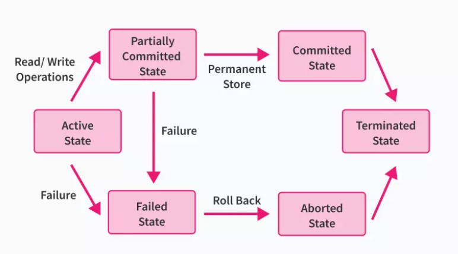
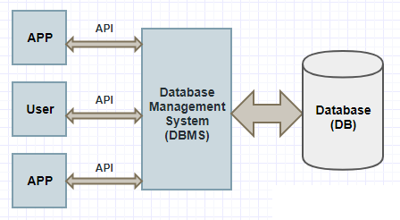
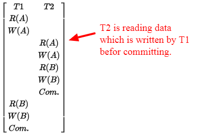
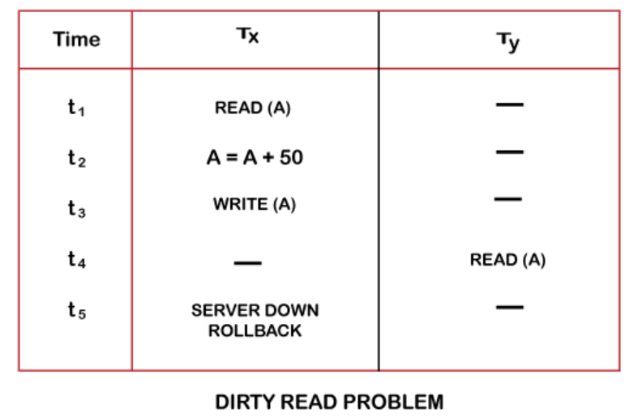
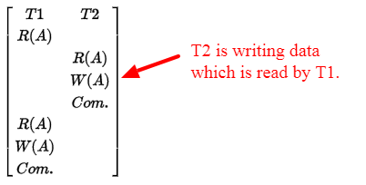
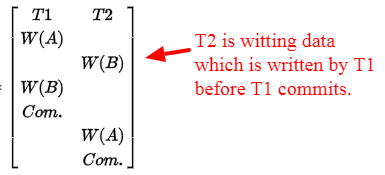
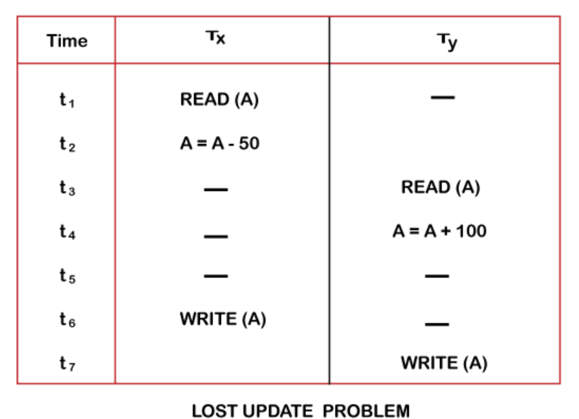

# Transaction in DBMS

### What is a DB Transaction?

In real-life situations, we might need to execute a series of queries in order to accomplish a task. We might do a club of CRUD operations in order to accomplish a task. These series of operations can execute a single unit of work based on our product and hence these series of operations are called DB Transactions.

Now during the transaction execution, our DB might go through a lot of changes & can be in an inconsistent intermediate state.

Our DB should not be in an inconsistent state.

**Transaction States in DBMS**
During the lifetime of a transaction, there are a lot of states to go through. These states update the operating system about the current state of the transaction and also tell the user about how to plan further processing of the transaction. These states decide the regulations which decide the fate of a transaction whether it will commit or abort.

The ROLLBACK statement undo the changes made by the current transaction. A transaction cannot undo changes after COMMIT execution.

Following are the different types of transaction States :

Active State: When the operations of a transaction are running then the transaction is said to be active state. If all the read and write operations are performed without any error then it progresses to the partially committed state, if somehow any operation fails, then it goes to a state known as failed state.

Partially Committed: After all the read and write operations are completed, the changes which were previously made in the main memory are now made permanent in the database, after which the state will progress to committed state but in case of a failure it will go to the failed state.

Failed State: If any operation during the transaction fails due to some software or hardware issues, then it goes to the failed state . The occurrence of a failure during a transaction makes a permanent change to data in the database. The changes made into the local memory data are rolled back to the previous consistent state.

Aborted State: If the transaction fails during its execution, it goes from failed state to aborted state and because in the previous states all the changes were only made in the main memory, these uncommitted changes are either deleted or rolled back. The transaction at this point can restart and start afresh from the active state.

Committed State: If the transaction completes all sets of operations successfully, all the changes made during the partially committed state are permanently stored and the transaction is stated to be completed, thus the transaction can progress to finally get terminated in the terminated state.

Terminated State: If the transaction gets aborted after roll-back or the transaction comes from the committed state, then the database comes to a consistent state and is ready for further new transactions since the previous transaction is now terminated.



Properties of Transaction in DBMS
There are four major properties that are vital for a transaction to be successful. These are used to maintain state consistency in the database, both before and after the transaction. These are called ACID properties.
- A - Atomicity
- C - Consistency
- I - Isolation
- D - Durability

## Atomicity

A transaction is a bundle of statements that intend to achieve one final state. When we are attempting a transaction, we either want to complete all the statements or none of them. We never want an intermediate state.

Eg. If Marino has an account namely A with $50 in it and wants to send $20 to Amanda who has an account namely B. An amount of $200 is already existing in account B. When $20 is deposited to account B, the total becomes $220.

Two procedures are now scheduled to take place. One is that the $20 that Marino wishes to send will be deducted from his account A and would be credited to account B, i.e., into Amanda's account. What happens now is that the initial debit operation succeeds, but the crediting operation fails.

As a result, the value in Marino's account A becomes 30$, while the value in Amanda's account remains $200 as it was earlier.
Therefore, this transaction is not an atomic transaction.

## Consistency

Data stored in a DB is always valid & in a consistent state.
This property means that the integrity constraints of a database are maintained so that the database is consistent before and after the transaction. It refers to the correctness of a database.

## Isolation

It is the ability of multiple transactions to execute without interfering with one another.  If 2 transactions run and start parallelly we don't want them to affect each other.
Read process -> What is the account balance?
Write process -> Update the account balance from 500 -> 700
So which ever comes first will do that operation. Read and Write operation doesnot know about each other.

Eg. Write process -> Update the account balance from 500 -> 700.
Read process -> What is the account balance?
But somehow the Write process failed to update the account balance from 500 -> 700.
But the Read process executed successfully and read the old previous data i.e.500 from the DB as the Write process execution failed.

This property means that multiple transactions can occur concurrently without causing any inconsistency to the database state. These transactions occur independently without any external interference. Changes that occur in a particular transaction are not visible/ accessible to any other transaction until that particular change in that transaction has been committed.


## Durability

If something changed in the DB and any unforeseen circumstances happened then our changes should persist. This property ensures that once the transaction has completed execution, the updates and modifications to the database are stored in and written to disk and they remain intact even if a system failure occurs. These updates become permanent and are stored in the non-volatile memory.

# ACID Properties in DBMS [Detailed Explanation]

## 1. Atomicity in DBMS
The term atomicity is the ACID Property in DBMS that refers to the fact that the data is kept atomic. It means that if any operation on the data is conducted, it should either be executed completely or not at all. It also implies that the operation should not be interrupted or just half completed. When performing operations on a transaction, the operation should be completed totally rather than partially. If any of the operations aren’t completed fully, the transaction gets aborted.
Sometimes, a current operation will be running and then, an operation with a higher priority enters. This discontinues the current operation and the current operation will be aborted.

In the example above, if we consider the case that both users get notified that the seat is booked and neither of them is allowed to be seated because only one seat is available on the train, that is a half-fulfilled transaction. The transaction would be complete if they were able to be seated as well. Instead, according to atomicity, the person who clicks the button first books the seat and gets the notification of having purchased a ticket, and the seats left are updated. The second person’s transaction is rolled back and they are notified that no more seats are available. Let us consider an easier example where one person is trying to book a ticket. They were able to select their seat and reach the payment gateway. But, due to bank server issues, the payment could not go through. Does this mean that their booked seat will be reserved for them?
No. This is because one full transaction means reserving your seat and paying for it as well. If any of the steps fail, the operation will be aborted and you will be brought back to the initial state.

Atomicity in DBMS is often referred to as the ‘all or nothing’ rule.

## 2. Consistency in DBMS
This ACID Property will verify the total sum of seats left in the train+sum of seats booked by users=total the number of seats present in the train. After each transaction, consistency is checked to ensure nothing has gone wrong.

Let us consider an example where one person is trying to book a ticket. They are able to reserve their seat but their payment hasn’t gone through due to bank issues. In this case, their transaction is rolled back. But just doing that isn’t sufficient. The number of available seats must also be updated. Otherwise, if it isn’t updated, there will be an inconsistency where the seat given up by the person is not accounted for. Hence, the total sum of seats left in the train + the sum of seats booked by users would not be equal to the total number of seats present in the train if not for consistency.

## 3. Isolation in DBMS
Isolation is defined as a state of separation. Isolation is an ACID Property in DBMS where no data from one database should impact the other and where many transactions can take place at the same time. In other words, when the operation on the first state of the database is finished, the process on the second state of the database should begin. It indicates that if two actions are conducted on two different databases, the value of one database may not be affected by the value of the other. When two or more transactions occur at the same time in the case of transactions, consistency should be maintained. Any modifications made in one transaction will not be visible to other transactions until the change is committed to the memory.

Let us use our example of 2 people trying to book the same seat to understand this ACID Property. Two transactions are happening at the same item on the same database, but in isolation. To ensure that one transaction doesn’t affect the other, they are serialized by the system. This is done so as to maintain the data in a consistent state. Let us consider that the two people that click ‘Book Now’, do so with a gap of a few seconds. In that case, the first person’s transaction goes through and he/she receives their ticket as well. The second person will not know of the same until the first person’s transaction is committed to memory. When the second person clicks on ‘Book Now’ and is redirected to the payment gateway, since the first person’s seat has already been booked, it will show an error notifying the user that no seats are left on the train.

## 4. Durability in DBMS
The ACID Property durability in DBMS refers to the fact that if an operation is completed successfully, the database remains permanent in the disk. The database’s durability should be such that even if the system fails or crashes, the database will survive. However, if the database is lost, the recovery manager is responsible for guaranteeing the database’s long-term viability. Every time we make a change, we must use the COMMIT command to commit the values.

Imagine a system failure or crash occurs in the railway management system and all the trains that everyone had booked have been removed from the system. That means millions of users would have paid the money for their seats but will not be able to board the train as all the details have been destroyed. This could lead to huge losses for the company as users would lose trust in them. In addition, it would create a lot of panics as these trains would be needed for important reasons as well.

</br>

>Transactions are nothing but a set of Read and Write operations.

</br>


# 3 Different Types of Read Write Conflict in DBMS 

### How does Data Conflict Occur in DBMS?
Data is saved into the database. And to fetch and write data from the database, you need to perform read and write operation on the data.

There are multiple entities (multiple users, multiple APPs, multiple websites…) performing these multiple operations on the same data at the same time.




Just as an instance, there is a centralized banking database where all the information about the users and the bank related information is saved.

There might be multiple user logins to their bank account and access the same bank information at the same time. They perform various operations like reading or updating or deleting the data.

So basically there are two types of operations that can be performed on the database.

**1. Read operation:**
Read the data value from the database. It is a safe operation, as it does not update any information in the database.

**2. Write operation:**
It writes data into the database and saved it for further use. After writing data, data has to be committed (Commit Operation) to making updated information available for further operations. This operation is more prone to vulnerability as it involves modifying database information.

For a data update operation, it involves both the reading and writing operation.

**What is Transaction in Database?**
The set of these multiple operations/instruction (to accomplish a particular task) are performed on the data. This set is called as Transaction.

Every entity accessing data holds different transaction and all the transactions execute simultaneously.

The operations involved in the successful Transaction:

- Read the data
- Modify read data values
- Write the data back
- Commit the transaction

While performing these operations by the different users on the same data at the same time may arise data conflict. As like, accessing data by one transaction before committing another transaction does not hold good and gives data conflict.

There are different types of data conflict happens during reading and writing operations called as “Read-Write conflict”.

## Different Types of Read Write Conflict in DBMS:

As I mentioned it earlier, the read operation is safe as it does modify any information. So, there is no Read-Read (RR) conflict in the database.

Any number of transactions are free to read the same data (without conflict) anytime as long as there is no write operation.

So, there are three types of conflict in the database transaction.

- Write-Read (WR) conflict
- Read-Write (RW) conflict
- Write-Write (WW) conflict

Let’s see one-by-one with the example.

### What is Write-Read (WR) conflict?
This conflict occurs when a transaction read the data which is written by the other transaction before committing.

In the following diagram, I am using the following notions

```
A, B - two different data objects from database

T1, T2 - two different transactions

R(A) - reading data A

W(A) - writing data A

Com. - committing transaction
```



Here, the transaction T2 is reading the data which is written by the T1 before T2 commits. It is also called as Dirty Read.

It violates the ACID property of data consistency rule.

Expected behavior:

The new transaction (says T2) should not read the value if any other another transaction (say T1) already has written the data and has not committed.

</br>

The dirty read problem occurs when one transaction updates an item of the database, and somehow the transaction fails, and before the data gets rollback, the updated database item is accessed by another transaction. There comes the Read-Write Conflict between both transactions.

Example:

Consider two transactions TX and TY in the below diagram performing read/write operations on account A where the available balance in account A is $300:



- At time t1, transaction TX reads the value of account A, i.e., $300.
- At time t2, transaction TX adds $50 to account A that becomes $350.
- At time t3, transaction TX writes the updated value in account A, i.e., $350.
- Then at time t4, transaction TY reads account A that will be read as $350.
- Then at time t5, transaction TX rollbacks due to server problem, and the value changes back to $300 (as initially).
- But the value for account A remains $350 for transaction TY as committed, which is the dirty read and therefore known as the Dirty Read Problem.

### What is Read-Write (RW) conflict?



Transaction T2 is Writing data which is previously read by transaction T1.

Here if you look at the diagram above, data read by transaction T1 before and after T2 commits is different.

Example:

Suppose Alice and Bob want to book the flight for their vacation. Alice open airlines website to check the availability and cost of the ticket. There is only one ticket is available. Alice finds it expensive and looks for other airlines fares if she gets any offers.
Meanwhile, Bob logins to the same airline portal and book the ticket. Now, there is no more flight ticket available.
Alice does not find any good offer on other airlines portal, she comes back to the previous airline portal. And tried to book a flight ticket even it is not available. Its Conflict, Read-Write (WR) conflict.

### What is Write-Write (WW) conflict?



Here Transaction T2 is writing data which is already written by other transaction T1. T2 overwrites the data written by T1. It is also called as a blind write operation.

Data written by T1 has vanished. So it is data update loss.

Example:

Alice and Bob share common Google-sheet online. Both read the file. Alice updates the document and forgets to save the file. On another end, Bob updates the Google sheet and save the file. The content updated by Alice is overwritten by Bob. The data updated by Alice is lost. It is called as Write-Write (WW) conflict.

</br>

The problem occurs when two different database transactions perform the read/write operations on the same database items in an interleaved manner (i.e., concurrent execution) that makes the values of the items incorrect hence making the database inconsistent.

Example:

Consider the below diagram where two transactions TX and TY, are performed on the same account A where the balance of account A is $300.



- At time t1, transaction TX reads the value of account A, i.e., $300 (only read).
- At time t2, transaction TX deducts $50 from account A that becomes $250 (only deducted and not updated/write).
- Alternately, at time t3, transaction TY reads the value of account A that will be $300 only because TX didn't update the value yet.
- At time t4, transaction TY adds $100 to account A that becomes $400 (only added but not updated/write).
- At time t6, transaction TX writes the value of account A that will be updated as $250 only, as TY didn't update the value yet.
- Similarly, at time t7, transaction TY writes the values of account A, so it will write as done at time t4 that will be $400. It means the value written by TX is lost, i.e., $250 is lost.

Hence data becomes incorrect, and database sets to inconsistent.
# Transaction in DBMS Example
- [VIDEO](https://drive.google.com/file/d/1ypGo-hYA6f1iM421rfdp5nl3OnDvC9Yy/view?usp=drive_link)

# How DBs ensure atomicity??

DBs ensure atomicity in 2 ways 

- Logging(Write-Ahead Log) -> Your DBMS logs all actions/queries that were executed in the transaction so that later it can undo them. This is pretty easy to understand. Every transaction is first appended to a log as a set of mutations to the state. Eventually, these mutations will make their way into the primary data structure (usually some kind of B-tree). In the event of a crash, mutations can be rolled back by undoing mutations specified in the log.
The cool thing about write-ahead logs is that writes happen sequentially. If you’re inserting lots of random data, you’ll still be doing fast, sequential writes. Eventually though, this data will be flushed into the primary data structure and you can’t avoid random writes. Still, this is great for short bursts of writes. These logs can be maintained in memory or disk depending on DBMS system to system. MYSQL uses this mechanism

- Shadow Paging -> DBMS makes copies of actions and this copy is initially considered a temporary copy. If the transaction is successful, it starts pointing to the new temporary copy. Shadow paging has a lot in common with persistent data structures. With shadow paging, you never modify existing data. With the WAL approach, existing pages will be modified when the log is flushed. In other words, updates are in-place. With shadow paging, updates are append only. If you’re using a tree, any modification to the nodes will result in a new root, and essentially a new tree. Atomicity in this case isn’t difficult to grasp. If a transaction is committed, the existing root node gets replaced with the new root. Otherwise, the new root is discarded. Eg. Your transactions are going to apply/make some changes in your DBs. You will not make changes directly on your DB rather you will create a copy of some partition of the DB and try to do all of those actions/changes in that copy. If the transaction is successful. You will start pointing to the new temporary copy instead of the old copy and the old copy will be later removed. Otherwise, if the transactions failed then u will not start pointing the temporary copy and the temporary copy will be removed. CouchDB uses this mechanism.

>Logging is the most preferred mechanism.

## SQL Commit and Rollback
COMMIT and ROLLBACK are performed on transactions. A transaction is the smallest unit of work that is performed against a database. Its a sequence of instructions in a logical order. A transaction can be performed manually by a programmer or it can be triggered using an automated program.

### SQL Commit
COMMIT is the SQL command that is used for storing changes performed by a transaction. When a COMMIT command is issued it saves all the changes since last COMMIT or ROLLBACK.

### SQL RollBack
ROLLBACK is the SQL command that is used for reverting changes performed by a transaction. When a ROLLBACK command is issued it reverts all the changes since last COMMIT or ROLLBACK.

## Atomicity for MySQL
After each commits or rollback, the DB remains in a consistent state.
In order to handle rollback,
- Undo Log
- Redo Log

Undo Log -> This log contains a record of how to undo the last change done by a transaction. If any other transaction needs the original data as a part of a consistent read operation, the unmodified data is retrieved from undo logs. This log stores copy of data that is being modified by any current transaction. So that, at the same time if any other transaction queries for the original data, this log will serve the purpose..!!

Redo Log -> The redo log is a disk-based Data Structure used for crash recovery to correct data written by incomplete transactions. The changes which could make it up to the data files before the crash or for any other reasons are replayed automatically during the restart of the servers after the crash. The transactions which were already executed, but not committed the disk due to some DB crash..! So, the Redo log records every transaction, holds until it gets committed and if needed, it will be used for crash recovery.

>By combining the Undo and Redo logs, MySQL ensures atomicity.

# ISOLATION

- [DOCs](https://en.wikipedia.org/wiki/Isolation_(database_systems))


# Database Isolation Levels

- [DOCs](https://medium.com/nerd-for-tech/understanding-database-isolation-levels-c4ebcd55c6b9)

## 4 Database Isolation Levels

### 1. Read Uncommitted
- There is almost no isolation here.
- It reads the latest uncommitted value at every step that can be updated from other uncommitted transactions.
- Dirty reads are possible.
- Pretty fast.

### 2. Read Committed
- Here Dirty reads are avoided. Because any uncommitted changes are not visible to any other transaction until we commit.
- In this level, each select statement will have its own snapshot of data which can be problematic if we execute the same select again because some other transaction might commit and update and we will see new data in the second select.

### 3. Repeatable Read
- A snapshot of select is taken the first time it runs during a transaction & the same snapshot is used throughout the transaction when the same select is executed.
- A transaction running at this level does not take into account any changes to data made by other transactions.
- But this brings Phantom Read problem i.e. new row can exist in b/w transaction which was not before.

### 4. Serializable
- It completely isolates the effect of 1 transaction from others. It is a repeatable read with more isolation to avoid phantom reads.
- Typically this isolation mode would lock the whole table, to prevent any other transactions from inserting or reading data from it.
- 2 transactions may occur almost one after another.
- Performance can be affected by this.
- In case of Booking Systems, this mechanism is good.
- Booking Systems are not a very fast mechanism.

Example: When you do a booking at BookMyShow, sometimes you will see it immediately says, hey, you are booked. Sometimes u will see that it says the booking is pending confirming the status in few minutes. And after sometimes booking has been confirmed, Because your transaction is still going on, it has to still complete itself. so they don't block u at the UI level they throw u back on the final confirmation page with a pending state and later when the states get updated then they can send some server-side events and there are multiple ways/mechanisms to handle it.  U can get the updated data back.


# Durability 

The DB should be durable enough to hold all the latest updates even if the system fails or restarts. If a transaction updates a chunk of data in the DB & commits the DB will hold the new data. If Transaction commits but the system fails before data could be written then data should be written back when the system restarts.

# Consistency
Consistency in InnoDB involves protecting data from crashes & maintaining data integrity & consistency.

InnoDB has 2 main features for maintaining consistency:

- DoubleWrite Buffer : It is a storage area where InnoDB writes pages flushed from buffer pool before writing the pages to their positions in data files. If a system crashes in middle of a page write, InnoDB can find a good copy from DoubleWrite Buffer.

    - Page :  It is a unit that specifies how much data can be transferred b/w disk and memory. A page can contain 1 or more rows. If 1 row doesn't fit in the page, InnoDB sets up additional pointers style DS so that the whole info. of 1 row can go in a page.
    - Flush : When we write something to the DB it is not written instantly for performance reasons in MySQL. It instead stores that either in memory or in temporary disk storage. InnoDB storage structures that are periodically flushed include Redo logs, Undo Logs, and Buffer Pools. Flushing can happen because a memory area became full and the system needs to free some space, because if there is a commit involved then the transaction has to be finalized.
- Crash Recovery : . Crash recovery is the process by which the database is moved back to a consistent and usable state. This is done by rolling back incomplete transactions and completing committed transactions that were still in memory when the crash occurred. Redo Logs and Undo Logs are also used for crash recovery. The integrity constraints of a database are also maintained so that the database is consistent before and after the transaction.


```
A storage engine is a software module that a database management system uses to create, read, update data from a database. There are two types of storage engines in MySQL: transactional and non-transactional.
For MySQL 5.5 and later, the default storage engine is InnoDB. 
```

# Transaction in DBMS [IMP]
- [VIDEO](../../Videos/Transaction%20in%20DBMS%202%20%5BIMP%5D.mp4)
