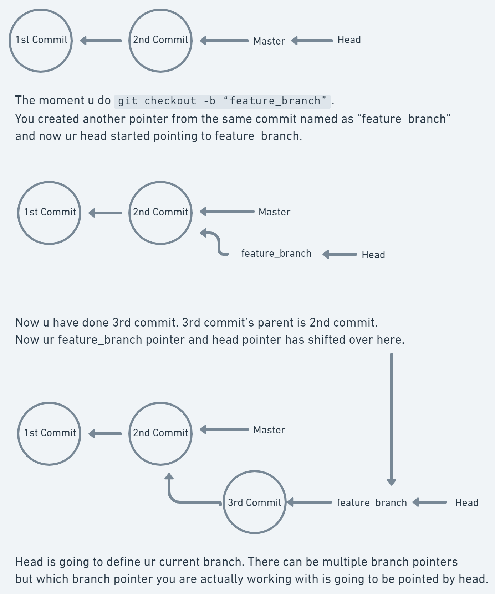

# Stash 

- `stash` - Sometimes you want to switch the branches, but you are working on an incomplete part of your current project. You don't want to make a commit of half-done work. Git stashing allows you to do so. The git stash command enables you to switch branches without committing the current branch. Generally, the stash's meaning is "store something safely in a hidden place." The sense in Git is also the same for stash; Git temporarily saves your data safely without committing.

**Stashes are not going to be created for untracked files. They will be only created for the changes that u do in a tracking file.How to track a file? Add that file in the staging area or there is a file already in the staging area which has some changes.**

- `git stash` -> To save it temporarily, we can use the git stash command. There is a piece of code u want to safely store somewhere but u don't want it to be part of the next commit. You are just going to add that particular file `git add config.js` and do `git stash`.
What it will do?
Whatever is there in your staging area it is going to create a stash out of it.

- `git stash list` -> To check the stored stashes.

- `git stash apply` -> It will bring back the last stash that u have saved. If there are multiple stashes, the last stash that u saved is going to be applied over here. Stash is maintained in Last In First Out.

- `git stash show` -> To track all the stashes and their changes. To see the changes in the file before stash and after stash operation.

- `git stash show stash@{<id>}` -> To track the specific stash and its changes using their <id>. To see the changes in the file before and after the stash operation in a particular stash.

- `git stash apply stash@{<id}` -> Now ur last stash will not going to be applied. Whatever version or id of stash that u have actually mentioned that particular stash will be applied.

- `git stash --include-untracked` -> To stash your working directory including untracked files (especially those that are in the .gitignore)

- `git stash --include-untracked -- <filename>` -> Add a particular file to a stash.

- `git stash pop` -> Git allows the user to re-apply the previous commits by using git stash pop command. The popping option removes the changes from stash and applies them to your working file.

The git stash pop command is quite similar to git stash apply. The main difference between both of these commands is stash pop command that deletes the stash from the stack after it is applied.

- `git stash drop` -> The git stash drop command is used to delete a stash from the stack. Generally, it deletes the most recent stash. Caution should be taken before using stash drop command, as it is difficult to undo if once applied.The only way to revert it is if you do not close the terminal after deleting the stash. It will not going to apply any changes like `git stash pop`, but it will going to remove the stash.

- `git stash drop stash@{<id>}` -> It will be going to drop that particular stash with that <id> and not apply any changes.

- `git stash clear` -> The git stash clear command allows deleting all the available stashes at once. To delete all the available stashes.

- `git stash save "<msg>"` -> To stash a change with a message.

- `git stash save "<msg>" --include-untracked` -> To stash a change of untracked files with a message. 

- `git commit --amend` -> commit --amend is used to modify the most recent/last commit. It combines changes in the staging environment with the latest commit, and creates a new commit with new commit ID. This new commit or commit ID replaces the latest commit entirely. 

Commit is an object. It is created by the commit message, timestamp etc.(Timestamp will never going to be same).
So it always going to create u a new commit object with a new hash SHA1 ID.

In `git reflog` u also store the amend. So nothing in git is actually lost. Somewhere, somehow, you can track everything.

# Branching & Heads

Branches are pointer to a commit.

- `git checkout -b "<BranchName>"` -> Using this command u r creating a branch. When u use this command it just creates a new pointer to a particular commit u are at. Whenever u start making another commit it just shifts that pointer to the new child commit that u r creating. So u can move that poniter here and there. So u can able to move the branch from here and there.

### HEAD

Head is a pointer that exist in the GIT repository. It tells u that what branch u r working on and what is the current commit is. The head does not only refer to the last commit, it also refers to the branch you are on.

- `git log --graph` -> It allows viewing your git log as a graph. To list the commits in the form of a graph. The git log graph command creates a graphic overview of how a developer's various development pipelines have branched and merged over time.

- `git branch` -> List all of the branches in your repository. This is synonymous with git branch --list.
Asterisk(*) is going to tell u what is ur current head pointing to.

- `git checkout BranchName` -> The git checkout command lets you navigate between the branches created by git branch.

- `git log --all --decorate --oneline --graph` -> It allows viewing your git log as a graph. To list the commits in the form of a graph. The git log graph command creates a graphic overview of how a developer's various development pipelines have branched and merged over time. You can see all of the commits and all of the branches and the head as well.

### Usecase of Branches

Most of the software projects have two mainstream branches as master and dev. The master branch is used for ready for production changes and the dev branch is used for testing purposes. When new changes are tested on the dev branch, eventually it will be merged into the master branch and finally, we will take a deployment on the master branch. Of course, these branch names and numbers can be changed but these are the most common ones.

Like many developers, we should work neither on the master branch nor on the dev branch directly. For every tiny or massive change in a software project, we should first create a new branch from the dev branch by naming the new branch related to our new change.

## Tags

Tags are ref's that point to specific points in Git history. Tagging is generally used to capture a point in history that is used for a marked version release (i.e. v1.0.1). A tag is like a branch that doesn’t change. Unlike branches, tags, after being created, have no further history of commits.

Tag is also a pointer. Tag can point to a particular commit. You can store some meta data inside a tag. Tags store meta data such as: the tagger name, email, and date. This is important data for a public release. 

- `git tag -a <TagVersion> -m "<msg>"` ->  Executing this command will create a new annotated tag identified by a certain version. It is also passed by the -m option and a message. eg. git tag -a v1.4 -m "my version 1.4".

***The tag pointer does not move with a new commit.***

- `git show <TagVersion>` -> You will be able to see what is the tag pointing to. Which commit the tag is pointing to.

- `git show-ref --tags` -> It will list all of the tags.

- `git push --tags origin master` -> It will push tags from the local master branch to the remote (Git) master branch. By default, the git push command doesn’t transfer tags to remote servers. You will have to explicitly push tags to GitHub after you have created them. 