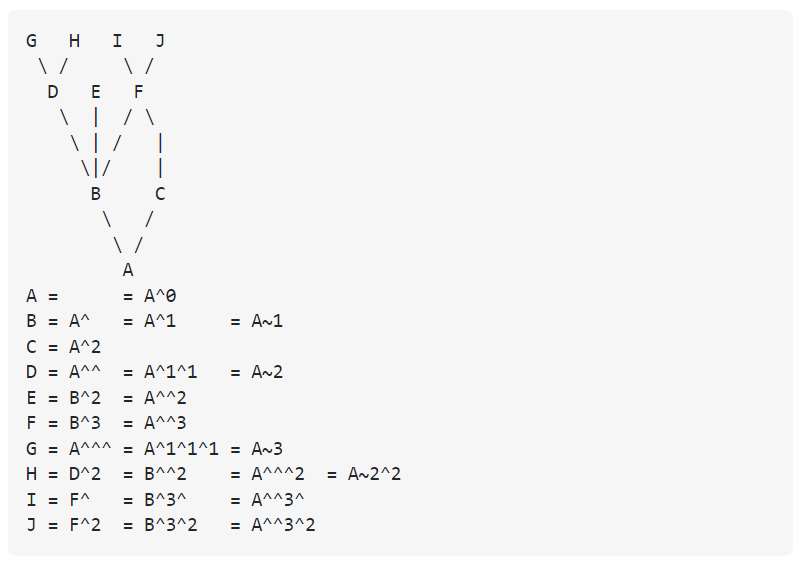
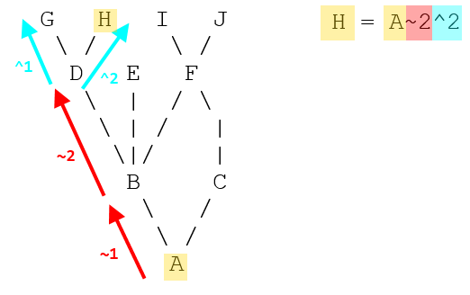

## GIT Logs

- `git log --since="<date>"` -> 

eg1. git log --since="yesterday" : Since yesterday how many commits we have made.

eg2. git log --since="1 minute ago" : How many commits we have made 1 minute ago.

eg3. git log --since="10.minute" : How many commits we have made 10 minutes ago.

- `git log --grep=<Commit Message>` -> You are only going to get the commit which is having `<Commit Message>` as a substring in the message.

- `git log <Commit ID>^<N>` -> If u want to switch to any particular parent of another merged branch. It will give u the immediate Nth parent. eg. ^2 means the second parent where a commit has more than one parent (i.e. because it's a merge).

- `git log <Commit ID>~<N>` -> It will give u the Nth node in your same ancestry chain. eg. ~2 means up two levels in the hierarchy, via the first parent if a commit has more than one parent

## Tilda (~n) and Caret (^n) Explanation

<video src="Tilda_Caret_Explanantion.mp4" controls="controls" style="max-width: 530px;"></video>

[VIDEO EXPLANATION](https://github.com/arijit69-web/BackEnd-Development-in-NodeJS/blob/master/13.%20Version%20Control%20with%20GIT/Screenshots/Tilda_Caret_Explanantion.mp4)

- `git merge <Other Branch Name>` ->  The git merge command lets you take the independent lines of development created by git branch and integrate them into a single branch.