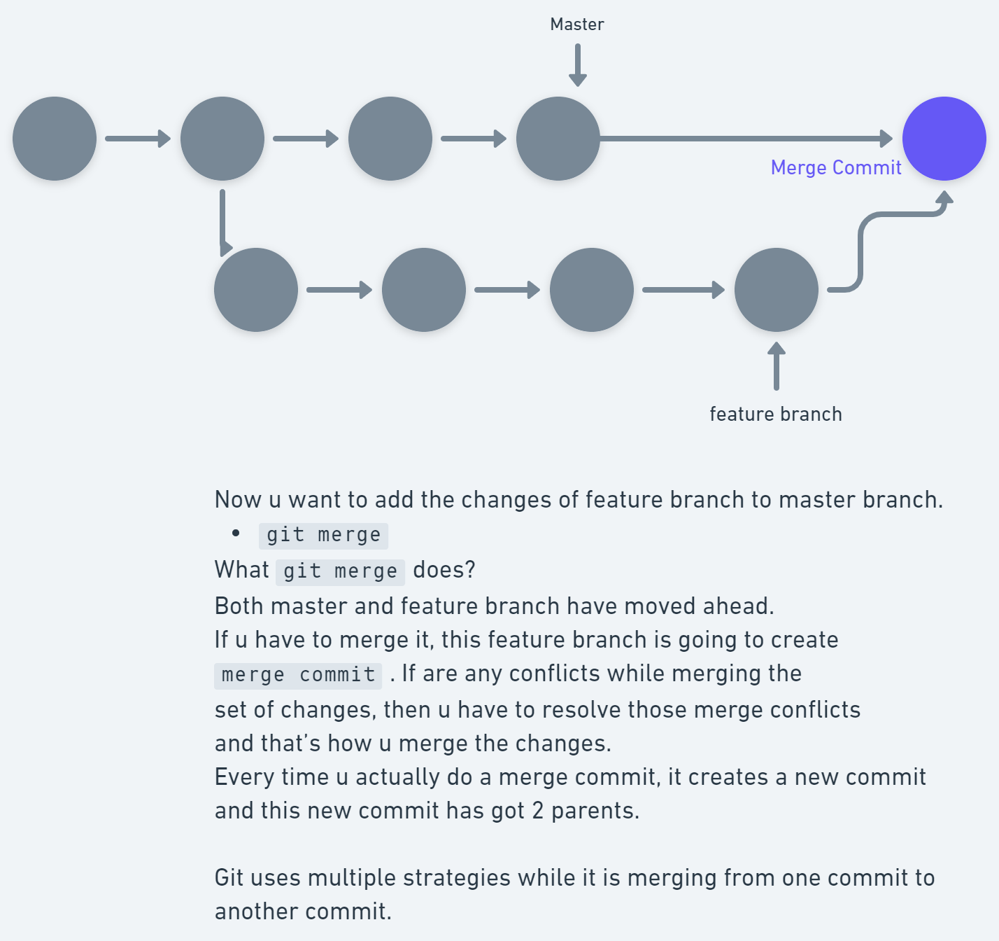
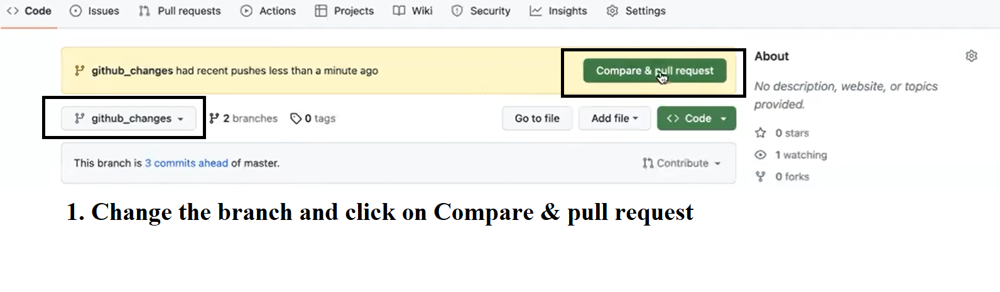
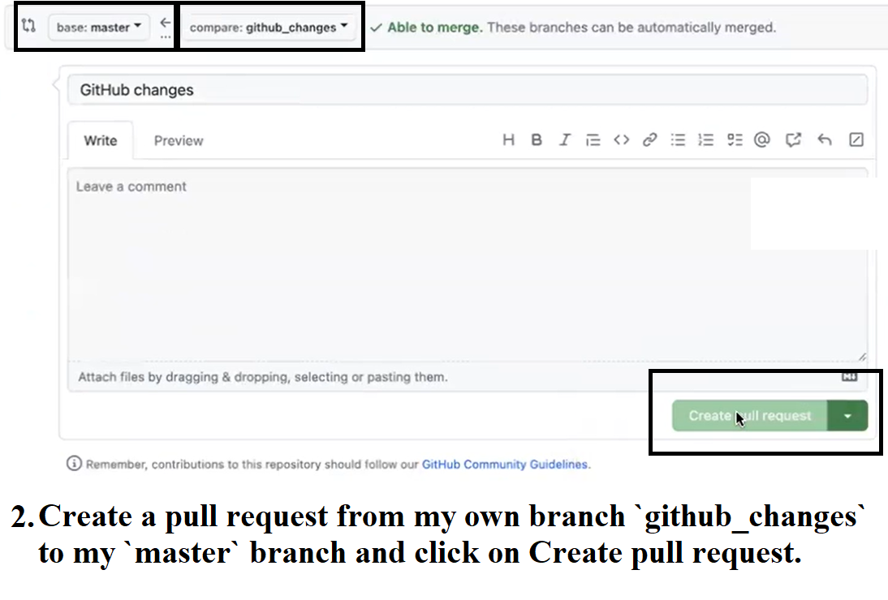
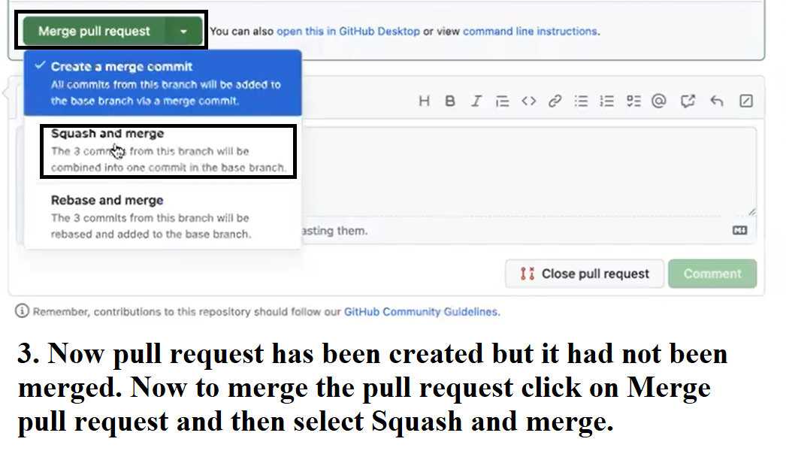
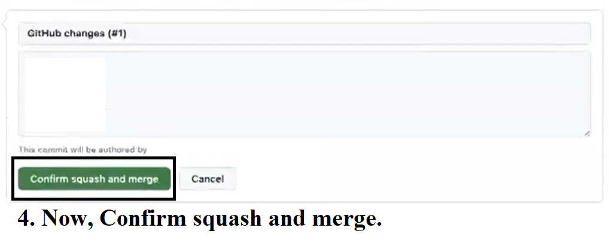

## Git Merge

- `git merge <branch>` -> Merging two branches. The git merge command lets you take the independent lines of development created by git branch and integrate them into a single branch. Now resolve the merge conflicts if there are any merge conflicts in the files.

**The Git merge strategy looks messy. So for that, we have Git Rebase.**

Visit this link to learn more about merge :

- [Git Merge](https://www.atlassian.com/git/tutorials/using-branches/git-merge#:~:text=Merging%20is%20Git's%20way%20of,merge%20into%20the%20current%20branch.)

## Git Rebase

Rebasing is the process of moving or combining a sequence of commits to a new base commit. Rebasing is most useful and easily visualized in the context of a feature branching workflow. It is a cleaner way to actually merge 2 branches together. So in this process, a sequence of commits is going to be moved to a new base commit. It actually creates copy but the main/master branch looks linear to u.

- `git rebase <base>` -> Git rebase in standard mode will automatically take the commits in your current working branch and apply them to the head of the passed branch.
This automatically rebases the current branch onto ＜base＞, which can be any kind of commit reference (for example an ID, a branch name, a tag, or a relative reference to HEAD).

Visit this link to learn more about rebase squash, rebase pick & Git Rebase Standard V/S Git Rebase Interactive :

- [Git Rebase](https://www.atlassian.com/git/tutorials/rewriting-history/git-rebase)

## `Squash and merge` & `Rebase and merge` can be done explicitly on GitHub too.

 

 

 

 

 

*In general, `rebasing with squashing` is recommended. When your changes are merged, most open source repositories or companies prefer `git rebase` over `git merge`.*

 

## Git Cherry Pick

`git cherry-pick <Commit ID>` ->
There are multiple branches: main, test, feature, production, deployment, etc. Now on the deployment branch, not everything will get deployed. If you do a `git pull` of one branch into the current branch, it will bring all the content of the other branch into the current branch. We are only interested in some specific commits that we can pick and add to the current branch. We can use **Cherry Pick** over here. Cherry Pick helps us to pick up certain sets of commits and only add that particular set of commits. It will not take all the content of the other branch into my current branch.

Visit these link to learn more about Git Cherry Pick :

- [Git Cherry Pick](https://www.atlassian.com/git/tutorials/cherry-pick)

 

## Git Pull V/S Git Fetch

`git pull <remote> <branch>` -> git pull tries to automatically merge after fetching commits. It is context sensitive, so all pulled commits will be merged into your currently active branch. git pull **automatically merges the commits without letting you review them first**. If you don’t carefully manage your branches, you may run into frequent conflicts.

`git fetch <remote> <branch>` -> git fetch gathers any commits from the target branch that do not exist in the current branch and stores them in your local repository. However, **it does not merge them with your current branch**. This is particularly useful if you need to keep your repository up to date, but are working on something that might break if you update your files. To integrate the commits into your current branch, you must use git merge afterwards.

 

## Git Rerere

The git rerere functionality is a bit of a hidden feature. The name stands for “reuse recorded resolution” and, as the name implies, it allows you to ask Git to remember how you’ve resolved a hunk conflict so that the next time it sees the same conflict, Git can resolve it for you automatically.

Visit these link to learn more about Git Rerere:

- [Git Rerere](https://git-scm.com/book/en/v2/Git-Tools-Rerere)

