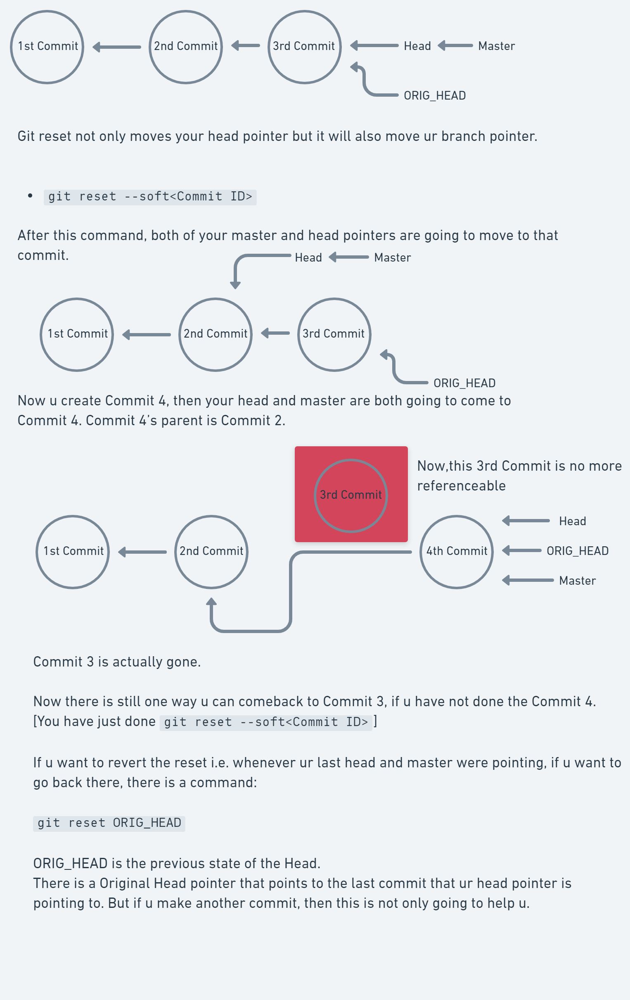
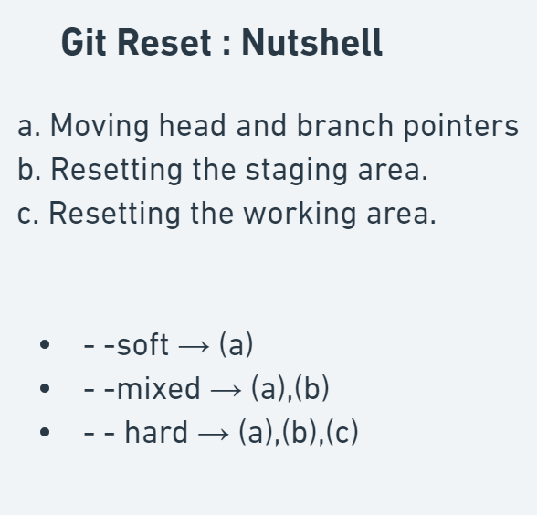

## Git Reset

***The Checkout will just move your head pointer.***
***Git Reset not only moves your head pointer but it will also moves your branch pointer.***

3 Types of Git Reset :
> Soft,
> Mixed,
> Hard

- `git reset --soft <Commit ID>` -> It is just going to move the HEAD pointer and the BRANCH pointer to the particular Commit ID.

- `git reset --soft HEAD~` -> HEAD~ means 1st parent of HEAD.
It is just going to move the HEAD pointer and the BRANCH pointer to the 1st parent of the HEAD pointer.

- `git reset ORIG_HEAD` -> It will move the HEAD pointer to the previous state of the HEAD. There is a Original Head pointer that points to the last commit that your HEAD pointer is pointing to.

- `git reset --soft HEAD~2` -> HEAD~ means 2nd parent of HEAD.
It is just going to move the HEAD pointer and the BRANCH pointer to the 2nd parent of the HEAD pointer.

***The soft mode only moves your pointer but the hard mode and the mixed mode can also make changes to ur staging area and working area.***

Visit these links to learn more about --mixed reset and --hard reset:

- ### [GIT Reset I](https://www.howtogeek.com/devops/how-does-git-reset-actually-work-soft-hard-and-mixed-resets-explained/)

- ### [GIT Reset II](https://www.atlassian.com/git/tutorials/undoing-changes/git-reset#:~:text=To%20review%2C%20git%20reset%20is,correspond%20to%20the%20three%20trees.)

- ### [Resetting V/S Checking Out V/S Reverting in GIT](https://www.atlassian.com/git/tutorials/resetting-checking-out-and-reverting)

## Reflog

Reference logs, or "reflogs", record when the tips of branches and other references were updated in the local repository. By default, the reflog expiration date in set to 90 days. Git reflog is a record of all commits that are or were referenced in your repo at any time.
That is why git reflog (a local recording which is pruned after 90 days by default) is used when you do a "destructive" operation (like deleting a branch), in order to get back the SHA1 that was referenced by that branch.

## Git Revert

- [Git Revert](https://www.atlassian.com/git/tutorials/undoing-changes/git-revert#:~:text=The%20git%20revert%20command%20is%20a%20forward%2Dmoving%20undo%20operation,in%20regards%20to%20losing%20work.)

