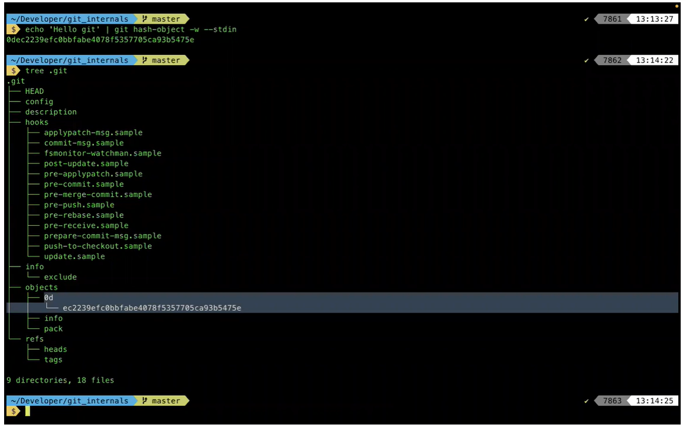
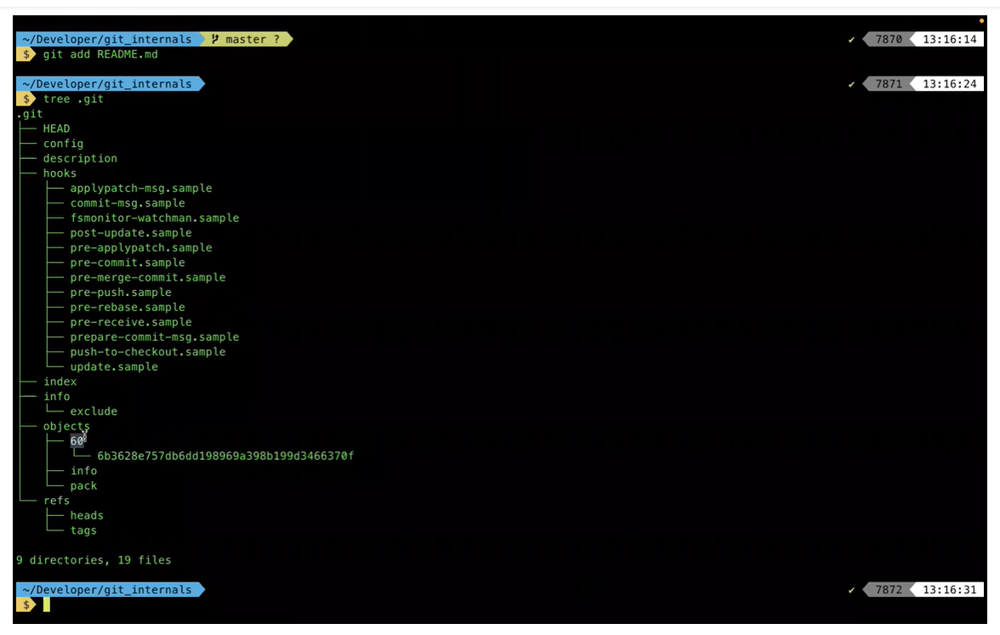

# How Git works internally?

- Whenever you actually make changes to your repository, inside the .git folder there is an objects folder, inside that objects folder, we actually stores a directory, inside which the directory name is the first 2 charcaters of the corresponding hash and inside that directory we have this file which is having the remaining 38 hash characters as the key.
Key : Directory Name(0d) + File Name(ec2239efc....)

Example 1:

Example 2: Creating a new README.md file.

- Whenever we will add/commit some data inside our repository. Everything is going to be have some piece of data. All of these piece of data is going to go through a SHA-1 hash and it is going to give us a hash key and the corresponding value is going to be a BLOB object that it actually stores. 

- So the hash is actually storing a BLOB, inside which u have the same content and u can visualise that content like this :
`git cat-file -p <Hash_Value>` : The command provides the content or the type of an object in the repository. The type is required unless -t or -p is used to find the object type, or -s is used to find the object size, or --textconv or --filters is used (which imply type "blob").

- For the exact same piece of identical data u are going to get the same hash value. If u are going to get the same hash in 2 files then why do u need to store 2 different objects out of it.

**The rest of the things are in COPY.**
