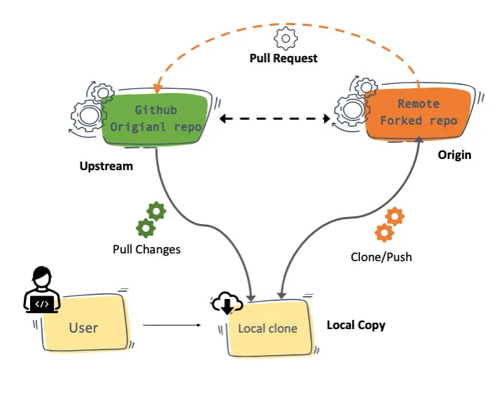

- `Fork` -> It is the new copy of the whole project that u are going to create on your own GitHub account. A fork is a rough copy of a repository. Forking a repository allows you to freely test and debug with changes without affecting the original project. One of the excessive use of forking is to propose changes for bug fixing.

-  `git clone <HTTPS URL>` -> It is primarily used to point to an existing repo and make a clone or copy of that repo at in a new directory, at another location. The original repository can be located on the local filesystem or on remote machine accessible supported protocols. The git clone command copies an existing Git repository.

- `Compare & pull request` **Button** on GitHub -> Pull requests let you tell others about changes you've pushed to a branch in a repository on GitHub. Hey maintainer of the project this is all the changes that I have done in yout project. Can u please read about this pull request? And if this pull request looks good to u please merge it in their main branch of the project. Then they are going to review your changes and if your changes are actually good they will merge it in their main branch of the project. Once a pull request is opened, you can discuss and review the potential changes with collaborators and add follow-up commits before your changes are merged into the base branch. 

### What is Upstream in Git?

Have you wondered how to keep the forked repo in sync with the main repo? It’s done by adding the main repo as the upstream. It is explained in the below sections.
Like the literal meaning, upstream refers to something which points to where it originated from.

In the git world, upstream refers to the original repo or a branch. For example, when you clone from Github, the remote Github repo is upstream for the cloned local copy.

Whenever you clone a git repository, you get a local copy in your system. So, for your local copy, the actual repository is upstream.

When you clone a Forked repository to your local, the forked repository is considered as the remote origin, and the repository you forked from is upstream.

This workflow is common in open-source development and even in normal project developments.

For example, If you wanted to contribute to an open-source project, this is what you do.

- You would fork the actual project repository.
- Then you clone from the forked repository.
- Meanwhile, to keep up with the main open-source repository, you pull the changes from it through your git upstream config.
- You push your changes to a branch in the forked repository.
- Then you would raise a PR to the actual project repository from your forked repository.

- `git remote add upstream <HTTPS URL>` -> It add the upstream to our repo with the main project repo URL using the add upstream command

- `git pull <RemoteName>` -> Once you have the upstream of the main project repo with u. You can do `git pull <RemoteName>`. This is going to actually pull the latest content from the main project repo. You asked to pull from the remote 'upstream', but did not specify a branch. This is why everything got downloaded.

- `git pull <RemoteName> <BranchName>` -> This will only download the latest content from the `<BranchName>` branch of the main project repo.

