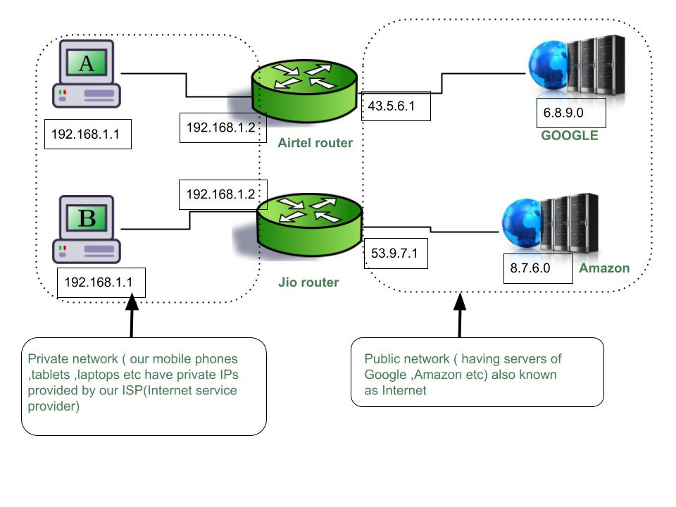

# Classful Addressing 

Classful Addressing refers to a method used to organize and assign IP (Internet Protocol) addresses to devices on a network. It was a system used in the early days of the internet but has been largely replaced by classless addressing.

In classful addressing, IP addresses were divided into different classes based on their range and intended usage. There were three main classes: Class A, Class B, and Class C. Each class had a different range of IP addresses and was designed to accommodate a different number of devices.

Class A addresses were assigned to large organizations, such as major companies or government agencies, as they provided a vast number of available addresses. Class B addresses were assigned to medium-sized organizations, while Class C addresses were meant for smaller networks, such as home or small office setups.

The main limitation of classful addressing was its inflexibility. Each class had a fixed number of available addresses, which often resulted in address wastage or insufficient addresses for certain organizations. This led to the development of classless addressing, which allows for more efficient allocation of IP addresses by using variable-length subnet masks (VLSM) and the creation of subnets.

Overall, classful addressing was a basic way to categorize and assign IP addresses in the early days of the internet. However, due to its limitations, it has been replaced by classless addressing, which provides more flexibility and efficient use of IP addresses.


**Example:** 
Imagine you have a big neighborhood with many houses. Each house has a unique address that helps the mail carrier deliver letters and packages to the right place. Now, think of the Internet as a gigantic neighborhood with millions and millions of devices connected to it, like computers, smartphones, and servers.

To make sure that data packets (like letters) can be sent to the correct devices on the Internet, classful addressing was used in the early days of the Internet. It divided the Internet into different classes based on the size of the networks and the number of devices they could support.

In classful addressing, there were five classes: A, B, C, D, and E. Each class had a fixed range of IP addresses that could be used. IP addresses are like unique street addresses for devices on the Internet. They help identify and locate devices.

Class A addresses were like huge neighborhoods with lots of houses. They could accommodate millions of devices. Class B addresses were smaller and could accommodate thousands of devices. Class C addresses were even smaller and could accommodate hundreds of devices.

The remaining classes, D and E, were used for special purposes. Class D addresses were used for multicasting, which means sending data to a group of devices at the same time. Class E addresses were reserved for experimental or research purposes.

# Classless Addressing 

Classless Addressing refers to a way of assigning IP addresses on the internet without strict rules based on predefined classes. It offers more flexibility and efficient use of available address space compared to the older classful addressing system.

In the past, IP addresses were divided into classes (Class A, B, and C) with fixed ranges, and each class had a specific number of network and host bits. This led to inefficient allocation of addresses, as organizations often received more addresses than they actually needed, resulting in wasted resources.

With classless addressing, IP addresses are no longer restricted to specific classes. Instead, they are divided into smaller and more flexible blocks called subnets. These subnets can be customized to match the exact requirements of an organization, allowing them to use the appropriate number of network and host bits based on their needs.

This flexibility enables more efficient utilization of IP addresses. For example, a small organization can have a subnet with fewer available addresses, while a large organization can have a larger subnet with more addresses. It also allows for easier routing and better allocation of address space across the internet.

In summary, classless addressing simplifies IP address allocation by providing more flexibility and efficient use of available addresses, allowing organizations to use only the necessary number of addresses and reducing wasted resources.


**Example:**
Imagine you're organizing a big party and you want to send invitations to all your friends. To make things easier, you divide your friends into groups based on where they live. You have friends who live in the same neighborhood, some in nearby towns, and others in different cities.

Now, instead of writing down the exact address of each friend, you decide to use a different approach called classless addressing. With classless addressing, you don't need to follow any specific rules or predefined groupings like neighborhoods, towns, or cities. Instead, you simply assign a unique number to each friend, regardless of where they live.

To send an invitation, you write down the friend's unique number on the invitation, and they can use that number to find their way to your party. It doesn't matter if they live nearby or far away. Each friend is identified by their individual number, making it easier for both you and your friends to keep track of everyone.

In computer networks, classless addressing works in a similar way. Instead of using fixed predefined groups like classes A, B, or C, each device on the network is assigned a unique number called an IP address. These addresses are not restricted to any specific range or class and can be chosen freely.

So, in simple terms, classless addressing is like giving each friend at your party a unique number, regardless of where they live, allowing you to communicate with them without being restricted by predefined groups or rules. Similarly, in computer networks, classless addressing gives each device a unique address, providing more flexibility and efficient use of available addresses.


# Can Two IP Addresses Be Same?

A simple definition of Computer Network is an interconnection of two or more computers(includes personal computers, mobiles, laptops, etc, network devices like a router, switch, bridge, etc)  for the purpose of transferring data. Now one obvious question arises how does one computer in the network identify another? Here, is the answer. By **MAC address** and **IP address**.

```
Note:
It is a hardware address given to each NIC(Network Interface Card). 

Can two devices have the same MAC address?
No.
Can two devices have the same IP address?  
Yes
```

### Why and How :
Now comes the interesting part, WHY and HOW? Let me first explain WHY and then HOW ingeniously we do that as follows.

## Example :
Here we have two routers Jio and Airtel both are connecting private networks and public networks. Remember we do not talk directly to Google or Amazon server or any public device directly, we talk via our ISP . we talk to ISP router and ISP router talk to the Internet. All ISP or public routers have public IP addresses that they purchase and all have different public IP addresses, they can’t be the same, as in fig. Airtel public IP is 43.5.6.1 and Jio public IP is 53.9.7.1. Now under each public IP address, any private IP address range can be used.  That’s why host A and host B in fig. can have the same private IP address. so within one network for ex-Airtel, all private IPs must be different but for hosts, on two different networks ex-Airtel and Jio hosts may have the same private IP address this way we reuse the private IPs.



## Conclusion :
All public IPs assigned to Routers of ISPs or Routers connecting to Internet are unique. but private IPs of two hosts can be the same if both are connected to different public networks. So the combination of public and private IP identifies your device uniquely. One interesting activity you can do, take two or more phones to connect all the phones with the hotspot of anyone’s phone. now on all the phones type on Google “what is my IP address” it will give you the public IP to which your phone is connected, (not the private IP), you will see all of your phones have the same public IP (because all of you are connected to the same public router) and to see your private IP  go to setting and then Wi-Fi and then Wi-Fi setting. You will see your private IP address ( for your mobile model please search on google how to find private IP). One more thing you will note here is that all of your private IPs will differ in a uniform manner. Because all of you have the same public network your private IP can’t be the same. 

