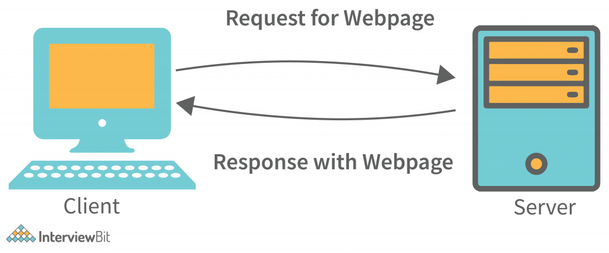
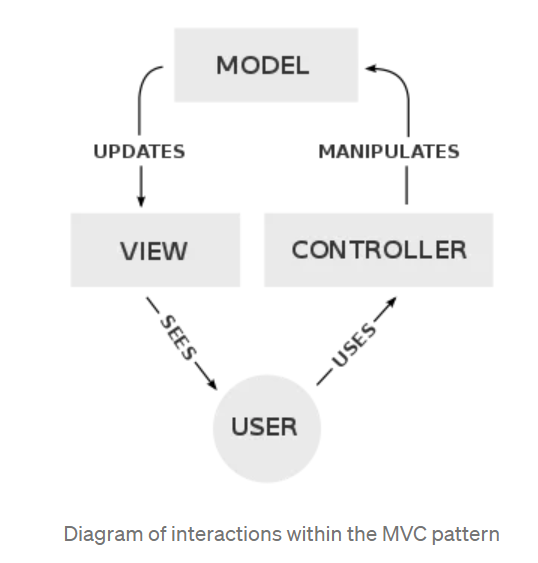

# How Internet works? | What happens when you type google.com in the browser?

## What happens when you type google.com in the browser?

- When we hit enter in the browser, the browser will send a request to the DNS server to resolve the IP address of www.google.com.

- The DNS server will send a request to the root DNS server to resolve the IP address of google.com.

- The root DNS server will send a request to the top-level domain DNS server to resolve the IP address of google.com.

- Internally DNS works on the concept of hierarchy. The root DNS server will send a request to the top-level domain DNS server to resolve the IP address of google.com.

> The URL consists of three parts: the protocol[https], the domain name[www.google.com], and the path. ex : `https://www.google.com/search?q=how+internet+works`

- The URL gets resolved to an IP address. And this resolution is done by the DNS server. [URL <-> IP Address]

- Earlier DNS used to be managed by the `Hosts.txt` file on the local machine. But now it is managed by the DNS server. This Hosts.txt consisted of the IP address and the domain name. The drawback of this approach is that if the IP address changes, we need to update the Hosts.txt file. This all used to be managed by Network Information Manager (NIM) which used to hold a source of truth for the IP address and the domain name. However, this was not scalable, and hence the DNS server was introduced.

> DNS (Domain Name System) is a hierarchical distributed naming system for computers, services, or any resource connected to the Internet or a private network. It associates various information with the domain names assigned to each of the participating entities. Most prominently, it translates more readily memorized domain names into the numerical IP addresses needed for locating and identifying computer services and devices with the underlying network protocols. By providing a worldwide, distributed directory service, the Domain Name System is an essential component of the functionality of the Internet, which has been in use since 1985.

- The DNS server is a server that holds the IP address and the domain name. It is a distributed system. Clearly, a better architecture than the NIM. The DNS being hierarchical, it has a root DNS server, which is the top-level DNS server. It has a list of all the top-level domain DNS servers. The DNS uses a Prefix tree, trie used for efficient prefix matching. The tries of course is a vast topic in itself, but the basic idea is that the tries are used to store the domain names in a tree-like structure and are able to query faster as compared to the hash tables.


- The top-level domain DNS server has a list of all the second-level domain DNS servers.

- The second-level domain DNS server has a list of all the third-level domain DNS servers.

- The third-level domain DNS server has a list of all the fourth-level domain DNS servers.

```text
Root DNS Server
 |
 |
 V
- Top Level Domain DNS Server (.com, .org, .in, .net, etc.)
 |
 |
 V
- Second Level Domain DNS Server (google.com, facebook.com, etc.)
 |
 |
 V
- Third Level Domain DNS Server (www.google.com, www.facebook.com, cs.harvard.edu, etc.)
 |
 |
 V
- Fourth Level Domain DNS Server
```

- `DNS cache` - The machine also maintains a local DNS copy. If not available locally, it will go to the DNS server and query for the IP address.
</br>


</br>

> `dig` is a network administration command-line tool for querying Domain Name System (DNS) name servers. It performs DNS lookups and displays the answers that are returned from the name server that was queried. It is a flexible tool that can be used to query any DNS server for any DNS record type. It is also a useful debugging tool for verifying DNS records.

```sh
arijit@arijit-VirtualBox:~$ dig google.com

; <<>> DiG 9.16.1-Ubuntu <<>> google.com
;; global options: +cmd
;; Got answer:
;; ->>HEADER<<- opcode: QUERY, status: NOERROR, id: 56983
;; flags: qr rd ra; QUERY: 1, ANSWER: 1, AUTHORITY: 0, ADDITIONAL: 1

;; OPT PSEUDOSECTION:
; EDNS: version: 0, flags:; udp: 65494
;; QUESTION SECTION:
;google.com.			IN	A

;; ANSWER SECTION:
google.com.		234	IN	A	142.250.193.238

;; Query time: 32 msec
;; SERVER: 127.0.0.53#53(127.0.0.53)
;; WHEN: Fri Apr 14 19:52:38 IST 2023
;; MSG SIZE  rcvd: 55


- `-short` is a flag to just get the IP address.

```sh
arijit@arijit-VirtualBox:~$ dig google.com +short
142.250.193.238
```

> `nslookup` is a computer network administration command-line tool available for many operating systems for querying the Domain Name System (DNS) to obtain a domain name or IP address mapping or for any other specific DNS record.

```sh
arijit@arijit-VirtualBox:~$ nslookup google.com
Server:		127.0.0.53
Address:	127.0.0.53#53

Non-authoritative answer:
Name:	google.com
Address: 142.250.193.238
Name:	google.com
Address: 2404:6800:4009:82e::200e
```
## Client Server Architecture.
</br>


- This communication behind the scenes works in a `Client Server Architecture`. Anything that makes a request is a client and anything that responds to the request is a server. This communication between the client and the server is done using the TCP/IP protocol. The TCP is a connection-oriented protocol. It establishes a connection between the client and the server. The TCP incurs with a 3-way handshake. The client sends an SYN packet to the server, the server responds with an SYN-ACK packet and the client responds with an ACK packet.

- `Vertical Scaling` is when we increase the size of the server. For example, if we have a 2GB RAM server, we can increase it to a 4GB RAM server. Drawback is that it is expensive and it is not scalable, also a single point of failure.
- `Horizontal Scaling` is when we increase the number of servers. For example, if we have a 2GB RAM server, we can add another 2GB RAM server. It's distributed and hence balanced out the load.
- `Load Balancer` is a server that distributes the load across the servers. It accommodates the health of the servers, if a server is down, it will not route the requests to the server.
- `Auto Scaling` provides users with an automated approach to increase or decrease the compute, memory or networking resources they have allocated, as traffic spikes and use patterns demand. `Auto Scaling` is a feature of AWS, GCP, Azure, etc. Drawback is that when we spin up a new server, it takes time to configure the server.


[Scaling hotstar.com for 25 million concurrent viewers](https://www.youtube.com/watch?v=QjvyiyH4rr0)


- The server architecture can be designed and implemented using `Microservices Architecture`, `Monolithic Architecture`. All codebase in a single repository is an example of Monolithic Architecture. Each service has it's own repository is an example of Microservices Architecture.

- Dev issues with Monolithic Architecture:
  - Codebase is huge.
  - Difficult to scale.
  - Difficult to maintain.
  - Difficult to test.
  - Difficult to deploy.
  - Difficult to debug.
  - Difficult to understand.
- Dev Benefits of Microservices Architecture:
  - Easy to scale.
  - Easy to maintain.
  - Easy to test.
  - Easy to deploy.
  - Easy to debug.
  - Easy to understand.

- Customer Pain points of Monolithic Architecture:
  - Slow
- Customer Benefits of Microservices Architecture:
  - Fast 

> There is no one-size-fits-all architecture. It depends on the use case. For example, if the use case is to build a simple blog, then Monolithic Architecture is the best choice. But if the use case is to build a complex application like Facebook, then Microservices Architecture is the best choice.

- `WebSockets` is a protocol that allows for bidirectional communication between the client and the server. It's not a Client Server Architecture, it's a Peer to Peer Architecture. It's a persistent connection between the client and the server. The piped connection between the client and the server is called a `Socket`, half-duplex connection, or full duplex connection. Based on TCP/IP protocol it similarly receives ACK packets from the server and sends ACK packets to the server. The use case for WebSockets is like a chat application where the messages are sent in real-time, for example, WhatsApp, Slack, etc.

- `PM2` Process Manager 2 can spawn multiple instances of the application and can also restart the application if it crashes. PM2 can also be used to deploy the application to the production server.


# MVC Architecture

- `MVC` is a design pattern that is used to separate the business logic from the presentation layer.

- Model is the data layer, View is the presentation layer and Controller is the business logic layer.

- Separation of Concerns is the main benefit of MVC as the business logic is separated from the presentation layer and the data layer.

- The business logic is separated from the presentation layer and the data layer.

- Likewise, the presentation layer is separated from the business logic and the data layer.

- Likewise, the data layer is separated from the business logic and the presentation layer.

- Unit Testing becomes easy because of keeping this good code hygiene.

- The code becomes more maintainable and scalable.

- The code becomes more readable and understandable.

- And likely the code will become more testable.

- MVC structure makes good code hygiene and makes the code more maintainable and scalable.

MVC is one of the most frequently used industry-standard web development frameworks to create scalable and extensible projects as it helps to write better organized and more maintainable code.

### But what exactly is MVC?

Model View Controller is a predictable software design pattern commonly used for developing user interfaces that divides the related program logic into three interconnected elements — the Model, the View, and the Controller.

Each of these components are built to handle specific development aspects of an application.

This design paradigm allows separation of concerns between the presentation of data from the way the data is accepted from the user and the data that is being shown.



Let us understand this in a bit more detail -

Model — It is the application’s dynamic data structure, independent of the user interface.

Often a Database, the structure of a model is how the schema of the database is. Here’s how a schema of a MongoDB document would look like -

```
const taskSchema = mongoose.Schema({
   title: {
      type: String,
      required: true
   },
   description: {
      type: String
   },
   completed: {
      type: Boolean,
      default: false
   }
});
```
View — It is a Graphical User Interface — what’s presented to the users and how users interact with the app. The View presents the model’s data to the user.

Mostly, the view is made with HTML, CSS, JavaScript and often templates. The visual representation can consist of data- like a list, table or functionality — like buttons, canvas for the user to interact with.

But the view doesn’t know how to update the model because that’s the controller’s job.

Here’s how the view can be constructed using React.js to display the data from the model above.

```
//Call to API to fetch tasks
return (
  <ul>
     {tasks.map((task) => (
        <li>
            <h2>{task.title}</h2>
              {task.description} 
              <button onClick = {updateTask}>{task.completed ? 'Completed' : 'Incomplete'}
              </button>
        </li>
     ))}
  </ul>;
)
```

Controller — The Controller exists between the view and the model.

The controller updates the view when the model changes. It also adds event listeners to the view and updates the model when the user manipulates the view.

In the above todo list web app, when the user clicks on the button to toggle the status of the task, the click is forwarded to the controller. The controller modifies the model to mark the item as completed / incomplete. If the data needs to be persistent, it also makes an async save to the server.

Here’s how the controller method can be written in Express using some Mongoose methods

```
export const updateTask = async (req, res) => {
   try {
      const updatedTask = await Task.findByIdAndUpdate(req.params.taskId, req.body, 
           {
               new: true,
           });
       res.status(201).json(updatedTask);
   } 
catch (error) {
      res.send(error);
   }
```


### Wrapping up

MVC is a framework for thinking about programming, and for organizing your program’s files. To signify the idea that the code should be organized by it's function, developers should create folders / files for each part of MVC.

MVC gives a starting place to translate one’s ideas into code, and it also makes coming back to our code easier, since we will be able to identify which code does what. In addition, the organizational standard MVC promotes makes it easy for other developers to understand our code.

</br>

# [Web Architecture](https://medium.com/storyblocks-engineering/web-architecture-101-a3224e126947)

