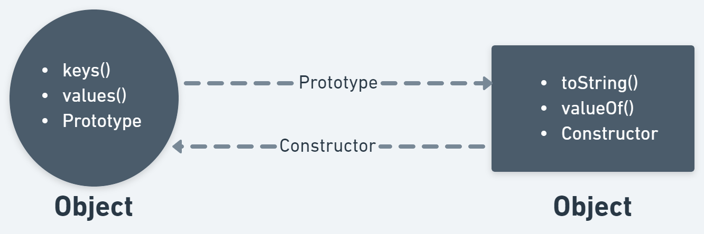
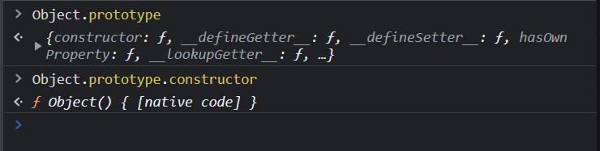
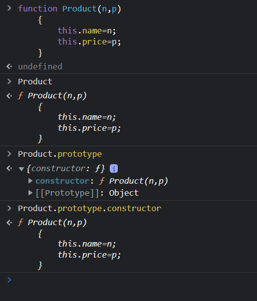
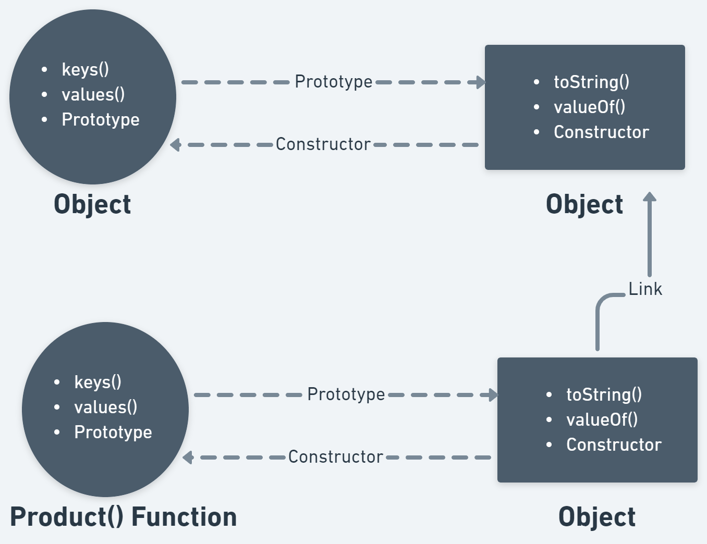
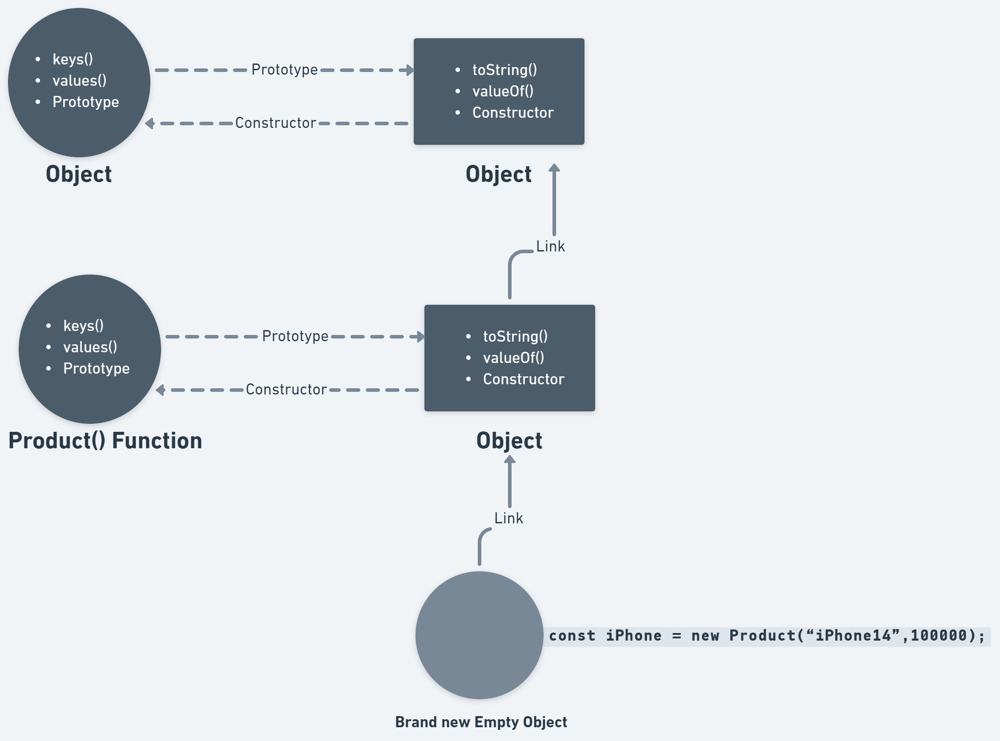
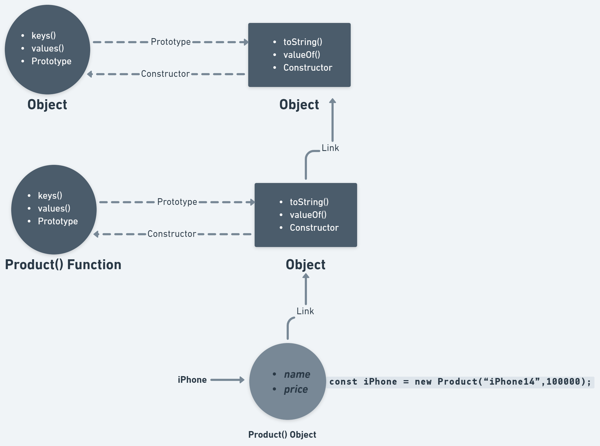
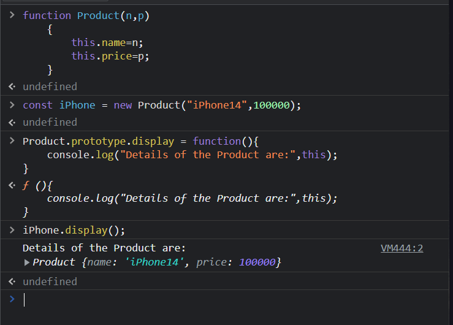
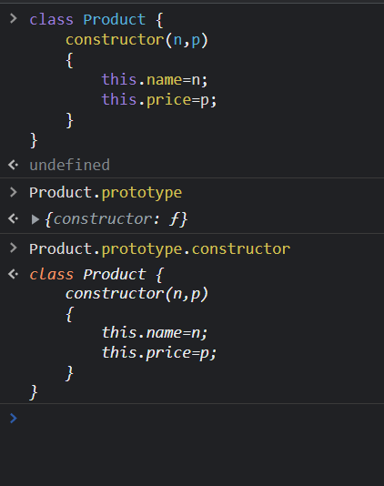
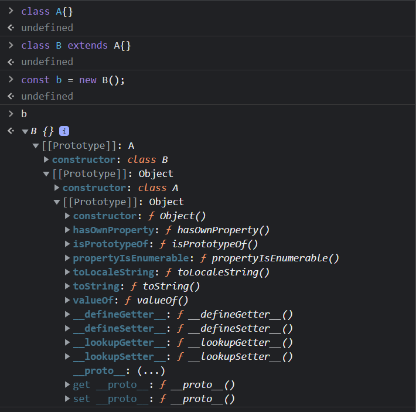
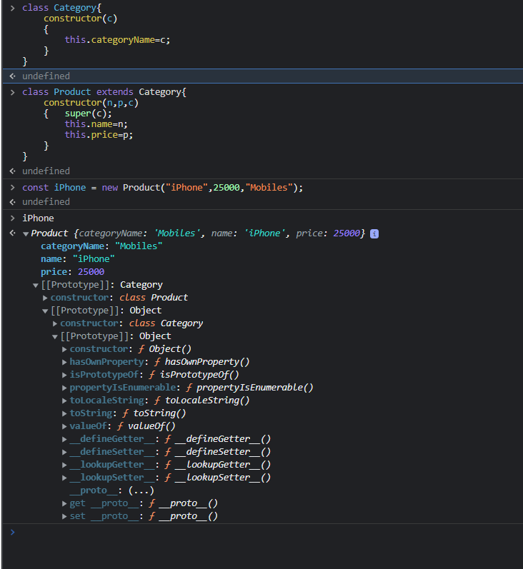

## What happens when we run JS code?

Object in JS is a function. This Object is actually a function which not only provides us with an object based functionality but it provides us some extra properties or some extra utilities functions.

```js
> Object
< ƒ Object() { [native code] }
```
JS maintains a function known as an Object. This function provide us with a lot of features.
Apart from this, there is another object. This is the most significant object in the whole architecture of JS. Some very important utility functions like toString(), valueOf(), etc. are actually present inside this object. In JS technically there is no specific name given to this particular object. However, you can refer to this object via a property of the `Object() Function` known as `Prototype`.

When u do `Object.prototype` then u are actually referring from the `Object() function` to the very important object `Object.prototype`.

From the `Object.prototype` u have a property that can help u to refer back to the `Object() Function`. That property is called `Constructor`.

`Object() function` has some properties like .keys, .values, etc and it has one more property called `.prototype` and this `.prototype` property actually points to another `JS Object`, and on that `JS object` there are some properties like .toString(), .valueOf(), etc and it has one more property called `.constructor` and this `.constructor` property actually points back to `Object function`.


</br>
</br>

</br>
</br>


> `Product.prototype` is actually internally linked to `Object.prototype`.


</br>

- The `new` keyword creates a completely `Brand new Empty Object`.

- This `Brand new Empty Object` is actually linked with `Product.prototype`.
</br>



- You assign a `this` keyword that actually refers to the call site i.e. `Brand new Empty Object`.

- Start executing the function `Product().`

- Assign a name & a price property on the `Brand new Empty Object`.



- If you have not manually returned any object from the `Product()` function, JS will assume that you want to return `this` and the `Product() Object` will get returned and stored inside the variable `iPhone`.

- The `Product() Object` does not have a `.constructor` but this `Product() Object` is linked to another object i.e. `Product.prototype` which has a `.constructor` property that is referAring back to the `Product() function`.
</br>
</br>

- On my `Product.prototype` I have assigned a new function `display()`. The `Product() Object` was already created which means the `iPhone object` was already in the memory.
And now I have made changes to my `Product.prototype`.

```js
Product.prototype.display = function(){
    console.log("Details of the Product are:",this);
}
```
- Now do `iPhone.display()`.



- During runtime JS will come to your iPhone object and will check 'Does your `iPhone object` have the `display()` property?' No, this iPhone object does not have this property. Now it will go one step above in the `Product.prototype` chain and see 'Does `Product.prototype` object has the `display()` property?' Yes, `Product.prototype` has a `display()` function and now it will call the `display()` function. You made changes to ur prototype and those changes are actually reflected in the `iPhone object`.

Example: 

```js
> iPhone.toString();
< '[object Object]'
```
Explanation:

During runtime JS will come to your iPhone object and will check 'Does your `iPhone object` have the `toString()` property?' No, this iPhone object does not have this property. Now it will go one step above in the `Product.prototype` chain and see 'Does `Product.prototype` object has the `toString()` property?' No, this Product.prototype object does not have this property. Now it will go one step above in the `Object.prototype` chain and see 'Does `Object.prototype` object has the `toString()` property?' Yes, `Object.prototype` has a `toString()` function and now it will call the `toString()` function.

>This is how `Prototypal Chaining` works. Your object is actually chained to a prototype that is chained to another prototype and so on. U can go upwards in the link chain. U can't go downwards in the link chain.

</br>
</br>

**Classes are just a wrap over what u have as functions.**

Example: 



Qs. What is `__ proto __` (dunder proto)?

Ans: `__proto__`(dunder proto) is a way to inherit properties from an object in JavaScript. `__proto__`(dunder proto) a property of Object. prototype is an accessor property that exposes the [[Prototype]] of the object through which it is accessed. This `__proto__`(dunder proto) sets all properties of the object set in its [[Prototype]] to the target object.

```js
> iPhone.__proto__
< {display: ƒ, constructor: ƒ}
```

## Inheritance in JS

- Behind the scenes, when u do `class B extends A{}` it is actually creating `Prototypal Chaining`.

</br>

Example 1: 



</br>

- `super` keyword

Example 2: 



</br>

> JavaScript only supports Multi-Level Inheritance and does not support Multiple Inheritance.

