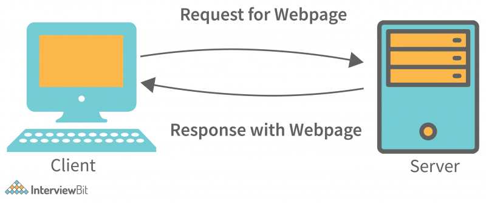

# Client-Server Architecture

- **Client** -> Any end system (Mobile phones, Laptops, PCs, process) that actually initiates a request is considered a  client. It wants to query some information. The client can be any computer that requests something from the server. For example – visiting any website we request the webpage from its domain. So here we act as a client.

- **Server** -> Servers collect these requests from clients. An end system (DB, Computer, process) that actually receives a request processes the request, extracts some data from it, and sends that data to the client. For the same example as above, the client asks for the webpage then the server responds with the webpage to the client.From a single application, a client can interact with multiple servers.

</br>



Suppose communication between client and server takes place via HTTP, and HTTP relies on TCP. There will be a TCP connection setup b/w client and server using a 3-way handshake and then over that TCP connection u make an HTTP request and receives an HTTP response.

Visit this link to learn more about Client-Server Architecture:
- [Client-Server Architecture](https://www.interviewbit.com/blog/client-server-architecture/)

# API (Application Programming Interface)

What is an **interface**? -> It stands like a contract of Application Programming. Some piece of logic/ software and how do u actually communicate with that or how do u programmatically use that, that contract is defined inside an API. eg. Browser APIs:
- setTimeout
- getElementByid

You just know 
- What input it takes.
- What output it will return.
- What processing it will do.

*Defination:*
In the context of APIs, the word Application refers to any software with a distinct function. Interface can be thought of as a contract of service between two applications. This contract defines how the two communicate with each other using requests and responses. Their API documentation contains information on how developers are to structure those requests and responses.
Somebody has hosted the functions/features on some live machines and exposed it to the end world over the internet where end users can actually interact or use it via network calls. These functionalities/APIs might be exposed via a library or via network calls.

# Framework

A software framework is a structure that you can use to build software. It acts as a foundation so you don't have to deal with creating unnecessary extra logic from scratch.

A framework is similar to a template in that you can modify it and add certain features and higher functionalities to create a complex and broad project that many people can use.
Software frameworks provide a template in which almost all general tasks have been handled. This allows you to focus on the core software development rather than the details of the process. Frameworks are made up of several libraries clubbed together. eg. Ruby on Rails.

```
The Top API Architecture Styles of 2023:
- REST 
- Webhooks
- SOAP 
- GraphQL 
- Websockets
- gRPC 
- MQTT 
- AMQP 
- Server-Sent Events 
- EDI 
- EDA 
- Other 
```

# REST (REpresentational State Transfer)

A set of guidelines that drive the architecture of the web. Representational State Transfer (REST) is a software architecture style for building scalable web services. REST services typically communicate via HTTP and are built using XML and JSON. 
>APIs that follow REST guidelines/recommendation are called REST APIs.

# gRPC
