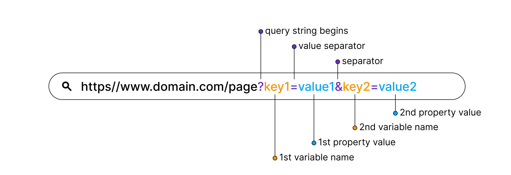
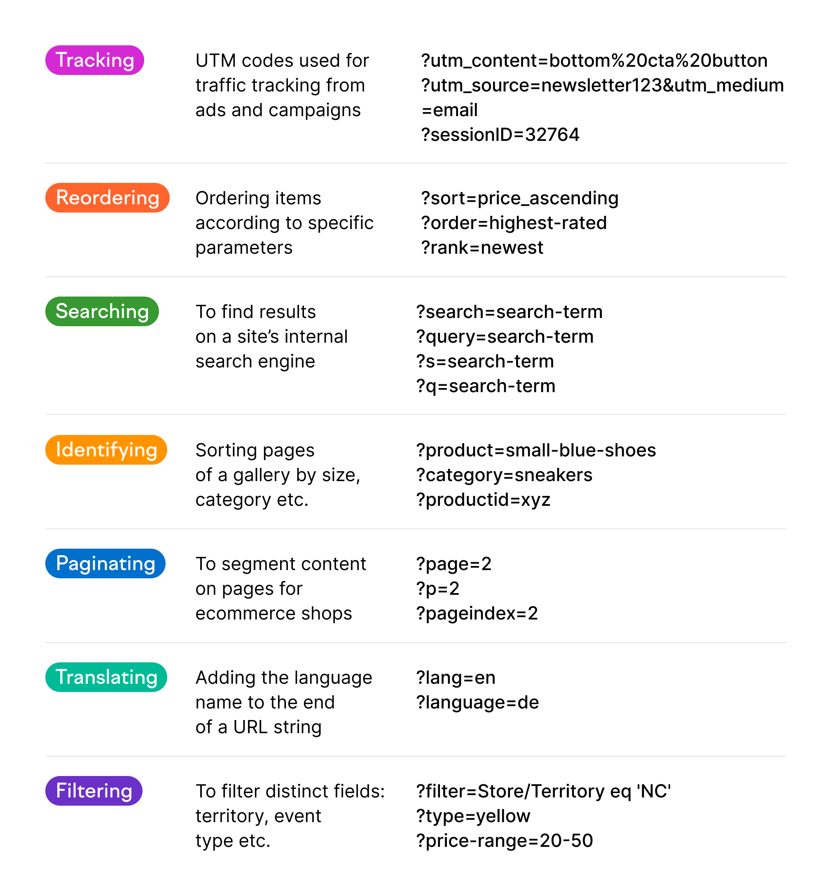

# Client-Server Architecture

- **Client** -> Any end system (Mobile phones, Laptops, PCs, process) that actually initiates a request is considered a  client. It wants to query some information. The client can be any computer that requests something from the server. For example – visiting any website we request the webpage from its domain. So here we act as a client.

- **Server** -> Servers collect these requests from clients. An end system (DB, Computer, process) that actually receives a request processes the request, extracts some data from it, and sends that data to the client. For the same example as above, the client asks for the webpage then the server responds with the webpage to the client.From a single application, a client can interact with multiple servers.

</br>


Suppose communication between client and server takes place via HTTP, and HTTP relies on TCP. There will be a TCP connection setup b/w client and server using a 3-way handshake and then over that TCP connection u make an HTTP request and receives an HTTP response.

Visit this link to learn more about Client-Server Architecture:
- [Client-Server Architecture](https://www.interviewbit.com/blog/client-server-architecture/)

# API (Application Programming Interface)

What is an **interface**? -> It stands like a contract of Application Programming. Some piece of logic/ software and how do u actually communicate with that or how do u programmatically use that, that contract is defined inside an API. eg. Browser APIs:
- setTimeout
- getElementByid

You just know 
- What input it takes.
- What output it will return.
- What processing it will do.

*Defination:*
In the context of APIs, the word Application refers to any software with a distinct function. Interface can be thought of as a contract of service between two applications. This contract defines how the two communicate with each other using requests and responses. Their API documentation contains information on how developers are to structure those requests and responses.
Somebody has hosted the functions/features on some live machines and exposed it to the end world over the internet where end users can actually interact or use it via network calls. These functionalities/APIs might be exposed via a library or via network calls.

# Framework

A software framework is a structure that you can use to build software. It acts as a foundation so you don't have to deal with creating unnecessary extra logic from scratch.

A framework is similar to a template in that you can modify it and add certain features and higher functionalities to create a complex and broad project that many people can use.
Software frameworks provide a template in which almost all general tasks have been handled. This allows you to focus on the core software development rather than the details of the process. Frameworks are made up of several libraries clubbed together. eg. Ruby on Rails.

```
The Top API Architecture Styles of 2023:
- REST 
- Webhooks
- SOAP 
- GraphQL 
- Websockets
- gRPC 
- MQTT 
- AMQP 
- Server-Sent Events 
- EDI 
- EDA 
- Other 
```

# REST (REpresentational State Transfer)

A set of guidelines that drive the architecture of the web. Representational State Transfer (REST) is a software architecture style for building scalable web services. REST services typically communicate via HTTP and are built using XML and JSON. 
>APIs that follow REST guidelines/recommendation are called REST APIs.

## Guidelines of REST to prepare good APIs:
- REST prefers a Client-Server communication should happen over HTTP.
- REST prefers JSON as the format to send and receive the data.
[JSON - JavaScript Object Notation is a standard text-based format for representing structured data based on JavaScript object syntax. Create a JSON file by putting the extension as .json.]
- REST gives guidelines on how the URL should look like.
    - In REST the main source of information is considered as a resource, eg. of resources: users, likes, comments, etc.
    - The endpoints/URL should use resources and not actions, eg. of actions: createPost, deletePost, addUser, etc. The REST conventions never mention actions in the URL/endpoints.
    - The resources we mentioned above are expected to be plural.
    - Eg. of REST URL -> [www.medium.com/blogs],[www.medium.com/blogs/2].
    - Every REST endpoint should be defined along with HTTP methods. eg. of HTTP methods: POST, GET, PUT, PATCH, & DELETE
        - GET -> The HTTP GET method is used to read (or retrieve) a representation of a resource.
            
            Examples:

            - /blogs (GET) -> read (or retrieve) data of all the blogs.
            - /blogs/12 (GET) -> read (or retrieve) data of the blog whose unique identifier value is 12.
            - /blogs/:id (GET) -> read (or retrieve) data of the blog having a unique identifier as `id`.
            - /blogs/:id/comments (GET) -> read (or retrieve) all the comments of the blog having a unique identifier as `id`.
            - /blogs/:id1/comments/:id2 (GET) -> read (or retrieve) the comment having a unique identifier as `id2` of the blog having a unique identifier as `id1`. *Don't use more than 3 levels of nesting, eg. `/a/:id/b/:id/c/:id`.*

        - POST -> The POST method is most often utilized to create new resources.

            Examples:
                  
            - /blogs (POST) -> create a blog. The information/details regarding the blog are sent inside the `req.body`. That `req.body` can take data in the form of JSON or in the form of simple text. You don't send the information/details regarding the blog in the URL and that is one of the most significant features of POST. As if you want to send any sensitive information, u send that in the request body so that no one can see/tamper with it. And if u don't send anything in the URL it can never be saved in the history.
            
        - PATCH -> PATCH is used to partially modify resources.

            Examples:

            - /blogs/:id (PATCH) -> modify/update the blog having a unique identifier as `id`. The information/details regarding the blog update are sent inside the `req.body`.

        - DELETE -> It is used to delete a resource identified by filters or ID.

            Examples:

            - /blogs (DELETE) -> delete all the blogs.
            - /blogs/12 (DELETE) -> delete the blog whose unique identifier value is 12.
            - /blogs/:id (DELETE) -> delete the blog having a unique identifier as `id`.

        - PUT -> PUT is used to modify/replace resources.
            
            Examples:

            - /blogs/:id (PUT) -> modify/update the blog having a unique identifier as `id`. The information/details regarding the blog update are sent inside the `req.body`.

- REST expects the response to have HTTP codes.

## API Versioning

API versioning is the practice of managing changes to an API and ensuring that these changes are made without disrupting clients.

<video src="https://drive.google.com/file/d/1WgjH7BAMzNDUnTae4Ssg8vXZAkWmMTEO/view?usp=share_link" controls="controls" style="max-width: 530px;"></video>

[VIDEO EXPLANATION](https://drive.google.com/file/d/1WgjH7BAMzNDUnTae4Ssg8vXZAkWmMTEO/view?usp=share_link)


## Sending data can be done in 3 ways:

- req.body

The req.body property contains key-value pairs of data submitted in the request body. An object containing text parameters from the parsed request body, defaulting to {}. By default, the request body can be URL-encoded or stringified as JSON.

- URL params

URL parameters known also as "query strings" or "URL query parameters" are elements inserted in your URLs to help you filter and organize content or track information on your website.
To identify a URL parameter, refer to the portion of the URL that comes after a question mark (?). URL parameters are made of a key and a value, separated by an equal sign (=). Multiple parameters are each then separated by an ampersand (&).



- Query params

URL parameter is basically used to identify a specific resource or resources whereas Query Parameter is used to sort/filter those resources.



</br>

## CRUD APIs

**CRUD** stands for CREATE, READ, UPDATE, and DELETE. These functions are the four pillars of a complete CRUD API. APIs that provide all these functionalities together are called CRUD APIs.