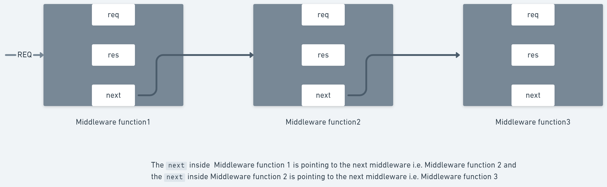
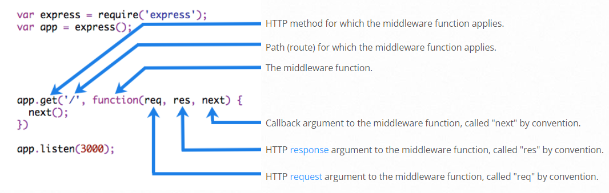
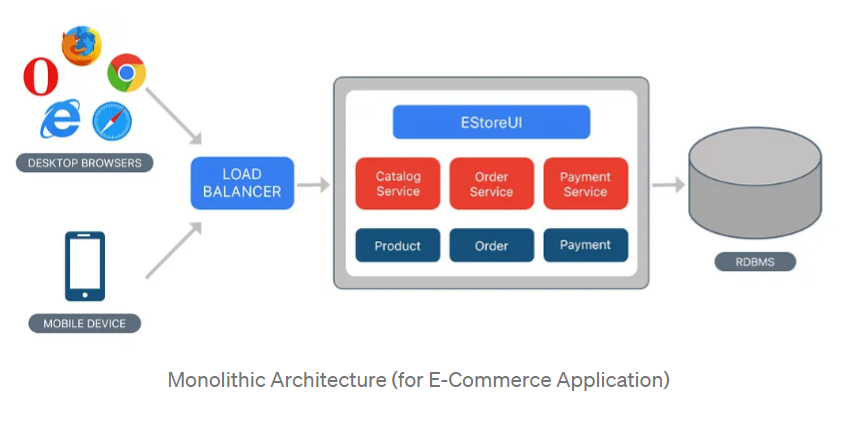
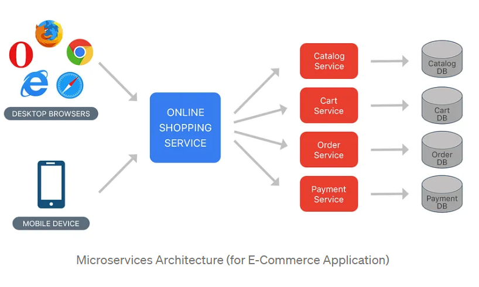
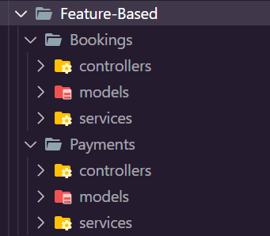
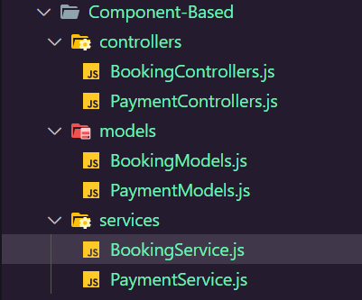

# MVC Architecture 

MVC (Model-View-Controller) is a pattern in software design commonly used to implement user interfaces, data, and controlling logic. It emphasizes a separation between the software's business logic and display. This "separation of concerns" provides for a better division of labor and improved maintenance. Some other design patterns are based on MVC, such as MVVM (Model-View-Viewmodel), MVP (Model-View-Presenter), and MVW (Model-View-Whatever).

The three parts of the MVC software-design pattern can be described as follows:

Model: Manages data and business logic.
View: Handles layout and display.
Controller: Routes commands to the model and view parts.

## Model View Controller example

Imagine a simple shopping list app. All we want is a list of the name, quantity and price of each item we need to buy this week. Below we'll describe how we could implement some of this functionality using MVC.

### The Model
The model defines what data the app should contain. If the state of this data changes, then the model will usually notify the view (so the display can change as needed) and sometimes the controller (if different logic is needed to control the updated view).

Going back to our shopping list app, the model would specify what data the list items should contain — item, price, etc. — and what list items are already present.

### The View
The view defines how the app's data should be displayed.

In our shopping list app, the view would define how the list is presented to the user, and receive the data to display from the model.

### The Controller
The controller contains logic that updates the model and/or view in response to input from the users of the app.

So for example, our shopping list could have input forms and buttons that allow us to add or delete items. These actions require the model to be updated, so the input is sent to the controller, which then manipulates the model as appropriate, which then sends updated data to the view.

You might however also want to just update the view to display the data in a different format, e.g., change the item order to alphabetical, or lowest to highest price. In this case the controller could handle this directly without needing to update the model.

## Server-Side Rendering V/S Client-Side Rendering

- [README](https://dev.to/codewithtee/server-side-rendering-ssr-vs-client-side-rendering-csr-3m24)

 

> Nowadays you will not find the `views` folder most of the time, instead, people will have a separate React/ Angular project that is going to act as views, and from that React/Angular project, they will directly call their controllers.In the views, you can set the UI template of the mail that you'll send to users.

 

## Middlewares

The controllers layer is divided into 2 separate layers:
- Middleware
- Controller

`Express Middleware` refers to a set of functions that execute during the processing of HTTP requests received by an Express application. Middleware functions access the HTTP request and response objects. They either terminate the HTTP request or forward it for further processing to another middleware function.
Middleware functions are functions that have access to the request object (req), the response object (res), and the next function in the application’s request-response cycle. The next function is a function in the Express router which, when invoked, executes the middleware succeeding the current middleware.

 

 
 

> In middleware, you can do Request Validation. Request validation is whether the incoming request follows the correct signature of the API contract or not. In the case that it isn't, you don't need to send it to the controller or to the backend; we will only revert the request from the middleware only.

# Project Folder Structure

> This is a base node js project template, which anyone can use as it has been prepared, by keeping some of the most important code principles and project management recommendations. Feel free to change anything.

- `src` -> Inside the src folder all the actual source code regarding the project will reside, this will not include any kind of tests. (You might want to make separate `tests` folder)

    Lets take a look inside the `src` folder:

    - `config` -> in this folder anything and everything regarding any configurations or setup of a library or module will be done. For example: setting up `dotenv` so that we can use the environment variables anywhere in a cleaner fashion, this is done in the `server-config.js`. One more example can be to setup you logging library that can help you to prepare meaningful logs, so configuration for this library should also be done here.

    - `routes` -> in the routes folder, we register a route and the corresponding middleware and controllers to it. Inside the routes folder, we can have different folders for different routes or for different API versions.
 
    - `middlewares` -> they are just going to intercept the incoming requests where we can write our validators, authenticators etc.

    - `controllers` -> they are kind of the last middlewares as post them you call you business layer to execute the budiness logic. In controllers we just receive the incoming requests and data and then pass it to the business layer, and once business layer returns an output, we structure the API response in controllers and send the output.

    - `services` -> contains the buiness logic and interacts with repositories for data from the database. Services will depend on another layer called repositories.

    - `repositories` -> this folder contains all the logic using which we interact the DB/ models by writing queries, all the raw queries or ORM queries will go here. Controllers don't directly talk to models.Services have business logic, so they don't directly talk to models. Repository talks to models.

    - `schema/models` -> defines the structure and the property of DB tables/ collections. It also has a logic to connect to DB. We can also define our triggers and stored procedures in this folder.

    - `utils` -> contains small reusable code, eg. helper methods, error handlers, regex validators etc.

    - `index.js` -> this is the entry point of the application, where we start the server and register all the routes and middlewares.

    - `rest.http` -> this is a file which contains all the API endpoints and their request and response bodies, this file can be used to test the APIs using the REST client extension in VS Code.

    - `seeders` -> A seed file/folder will contain dummy data that populates your database so that you can test if your models and projects are working the way you want them to.

    - `migrations` -> Migrations are `Django's` way of propagating changes you make to your models (adding a field, deleting a model, etc.) into your database schema.
    Migration files are used to do version control of your DBs.

# EJS - The Templating Engine

EJS (Embedded JavaScript Templating) is one of the most popular template engines for JavaScript. As the name suggests, it lets us embed JavaScript code in a template language that is then used to generate HTML. HTML cannot contain logic. By using EJS, you can combine HTML and JS logic in one HTML file.

# Monolithic Architecture 

Monolith means composed all in one piece. The Monolithic application describes a single-tiered software application in which different components combined into a single program from a single platform. Components can be:

- Authorization — responsible for authorizing a user
- Presentation — responsible for handling HTTP requests and responding with either HTML or JSON/XML (for web services APIs).
- Business logic — the application’s business logic.
- Database layer — data access objects responsible for accessing the database.
- Application integration — integration with other services (e.g. via messaging or REST API). Or integration with any other Data sources.
- Notification module — responsible for sending email notifications whenever needed.
Example for Monolithic Approach

Consider an example of Ecommerce application, that authorizes customer, takes an order, check products inventory, authorize payment and ships ordered products. This application consists of several components including e-Store User interface for customers (Store web view) along with some backend services to check products inventory, authorize and charge payments and shipping orders.

 

**Benefits:**

- Simple to develop — At the beginning of a project it is much easier to go with Monolithic Architecture.
- Simple to test. For example, you can implement end-to-end testing by simply launching the application and testing the UI with Selenium.
- Simple to deploy. You have to copy the packaged application to a server.
- Simple to scale horizontally by running multiple copies behind a load balancer.

**Drawbacks:**

- Maintenance — If Application is too large and complex to understand entirely, it is challenging to make changes fast and correctly.
- The size of the application can slow down the start-up time.
- You must redeploy the entire application on each update.
- Monolithic applications can also be challenging to scale when different modules have conflicting resource requirements.
- Reliability — Bug in any module (e.g. memory leak) can potentially bring down the entire process. Moreover, since all instances of the application are identical, that bug impact the availability of the entire application
- Regardless of how easy the initial stages may seem, Monolithic applications have difficulty to adopting new and advance technologies. Since changes in languages or frameworks affect an entire application, it requires efforts to thoroughly work with the app details, hence it is costly considering both time and efforts.
- Single point failure.

# Microservices Architecture
Microservices are an approach to application development in which a large application is built as a suite of modular services (i.e. loosely coupled modules/components). Each module supports a specific business goal and uses a simple, well-defined interface to communicate with other sets of services.

Instead of sharing a single database as in Monolithic application, each microservice has its own database. Having a database per service is essential if you want to benefit from microservices, because it ensures loose coupling. Each of the services has its own database. Moreover, a service can use a type of database that is best suited to its needs.

Consider the same example of the e-commerce application, which consists of several components/modules. Define each component/module as a separate loosely coupled service depending on the requirement, which may collaborate with each other based on the scenario. We can have following services for a complete application:

- Authorization Service — Responsible for authorizing customer.
- Order Service — takes an order and process it.
- Catalog Service — Manage products and check products inventory.
- Cart Service — Manage user cart, this service can utilize Catalog service as a data source.
- Payment Service — Manage and Authorize payments.
- Shipping Service — Ships ordered products.

 

 

**Benefits:**

- Microservices Enables the continuous delivery and deployment of large, complex applications.
- Better testability — services are smaller and faster to test.
- Better deployability — services can be deployed independently.
- It enables you to organize the development effort around multiple teams. Each team is responsible for one or more single service. Each team can develop, deploy and scale their services independently of all of the other teams.
- Each microservice is relatively small
- Comfortable for a developer to understand
- The IDE is faster making developers more productive
- The application starts faster, which makes developers more productive, and speeds up deployments
- Improved fault isolation. For example, if there is a memory leak in one service then only that service is affected. The other services continue to handle requests. In comparison, one misbehaving component of a monolithic architecture can bring down the entire system.
- Microservices Eliminates any long-term commitment to a technology stack. When developing a new service you can pick a new technology stack. Similarly, when making major changes to an existing service you can rewrite it using a new technology stack.

**Drawbacks:**

- Developers must deal with the additional complexity of creating a distributed system.
- Developer tools/IDEs are oriented on building monolithic applications and don’t provide explicit support for developing distributed applications.
- Testing is more difficult as compared to Monolith applications.
- Developers must implement the inter-service communication mechanism.
- Implementing use cases that span multiple services without using distributed transactions is difficult.
- Implementing use cases that span multiple services requires careful coordination between the teams.
- Deployment complexity. In production, there is also the operational complexity of deploying and managing a system comprised of many different service types.
- Increased memory consumption. The microservice architecture replaces N monolithic application instances with NxM services instances. If each service runs in its Container, which is usually necessary to isolate the instances, then there is the overhead of M times as many Containers.

## 2 Types of implementations in MVC Architecture:

- Feature-Based

- Component-Based

