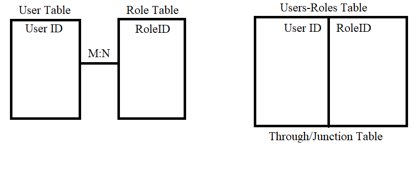

# Many to Many Associations
### Roles and Users 

- 1 user can have many roles and 1 role can belong to many users
- When you need to set up many to many associations, you need to set up a through table/junction table

- [M:N Associations Sequelize DOCs](https://sequelize.org/docs/v6/advanced-association-concepts/advanced-many-to-many/)