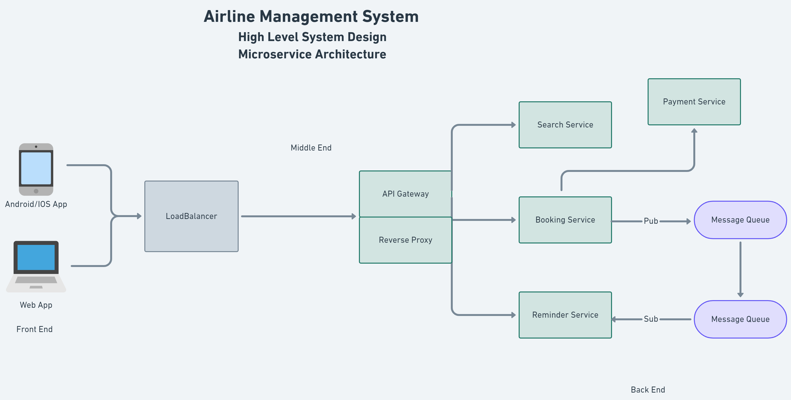

# Functional Requirements & Non-Functional Requirements

Requirements analysis is very critical process that enables the success of a system or software project to be assessed. Requirements are generally split into two types: Functional and Non-functional requirements.

**Functional Requirements:** These are the requirements that the end user specifically demands as basic facilities that the system should offer. All these functionalities need to be necessarily incorporated into the system as a part of the contract. These are represented or stated in the form of input to be given to the system, the operation performed and the output expected. They are basically the requirements stated by the user which one can see directly in the final product, unlike the non-functional requirements.

**Non-Functional Requirements:** These are basically the quality constraints that the system must satisfy according to the project contract. The priority or extent to which these factors are implemented varies from one project to other. They are also called non-behavioral requirements.
They basically deal with issues like:

- Portability
- Security
- Maintainability
- Reliability
- Scalability
- Performance
- Reusability
- Flexibility

 

# Airline Management System

## Non-Functional Requirements of the Project:

- More flight searches than bookings because we search flights more to find which is the cheapest flight or which flight has the minimum stops or duration etc. etc. and at last book one ticket so the search query is more than the booking query.

- The system needs to be reliable in terms of booking. Eg. Money has been deducted 2-3 times or money has been deducted but the booking has not been made, etc. This kind of thing should not occur.

- Expect that we will have 1 lakh users in total. 1 lakh bookings might come up in a quarter.

- In one day, you might get 100 bookings from registered users.

- During booking, the system should ensure that the prices don't change. Eg. It shouldn't happen that your payment is going on and the flight price changes. Before the payment starts, the price may change. Once the payment process starts, the price should not change.

- The system should be able to auto-scale itself for at least 3x more traffic.

 

## High Level System Design of Airline Management System

 

 

## Workflow of the Project

 

- The client will not interact with the server directly. The client will just make a request to the `Load Balancer`. The `Load Balancer` will be responsible for actually redirecting our request to the Internal Server based on which request is coming up and which server is healthy. The `Load Balancer` task is to balance out the load between the whole architecture. 

- Scale up the `Search Service` as we can expect a good amount of load on our `Search Service`.  

- Once the user gives the request to the `Search Service` and now if the user wants to start the booking those booking details will be transferred to the `Booking Service` and the booking is going to be maintained in the `Booking Service`. 

- An `API Gateway` is an API management tool that sits between a client and a collection of backend services. The `API Gateway` acts as a `Reverse Proxy` to accept all `Application Programming Interface` (API) calls or requests. The `API Gateway` sends the requests to specific services, which aggregate the different services to fulfill and return the requested results. The `Load Balancer` forwards the request to the `API Gateway`. Inside the `API Gateway`, there is a `Reverse Proxy`.

- I don't want my frontend to directly communicate with the backend services. Our frontend will send a request to our proxy and now the proxy will decide that this request needs to send to the service a or b or c. After computing the req by the services the services will send the response to `API Gateway` and `API Gateway` will aggregate all the services' responses and then return the results to the corresponding client.

- A `Reverse Proxy` server is a type of proxy server that typically sits behind the firewall in a private network and directs client requests to the appropriate backend server. A reverse proxy provides an additional level of abstraction and control to ensure the smooth flow of network traffic between clients and servers.

- `API Gateway` does a lot of tasks:

    - Rate limitations

    - Authentication/Authorization

    - Data aggregation

- There will be one more layer in between the API Gateway and the services. In highly scalable big applications, this layer is called the `Orchestrator/Orchestration Layer`.

- A `Microservice Orchestration` pattern involves a central orchestration service (the orchestrator) that typically contains the entire business workflow logic and issues commands to and awaits responses from worker microservices. Think of this as an orchestra where a central conductor is responsible for keeping the orchestra in sync and coordinating the members to produce a cohesive musical piece. Using orchestrators for your application is essential for efficiently managing applications based on microservices.

- The `Booking Service` will not directly communicate with the `Reminder Service`. We can do the asynchronous operation without fail. We don't need to be immediately available to send a message or email to a user who has just booked a flight. So the `Message Queue` comes into the picture. The `Booking Service` will be going to publish (pub) a lot of messages/emails to `Message Queues`. These `Message Queues` will collect all the requests from the `Booking Service` and keep them to themselves. Now the `Reminder Service` when less load is there is going to fetch/subscribe(sub) the messages/emails from these `Message Queues`. A `Pub-Sub` method will be used over here. Using this method will not put a lot of strain on your `Reminder Service`. In our project, we will be using `Rabbit MQ`.

- The `Reminder Service` must send reminders/mail/messages to the user to do self-checking and get the boarding pass 48 hrs before their flight. How to handle that? We can schedule `Cron Jobs`. `Cron Jobs` are a standard method of scheduling tasks to run on your server. Cron is a service running in the background that will execute commands (jobs) at a specified time, or at a regular interval.

- How can we actually scale each service?

    We will deploy each and every service and in front of every service we will maintain a `LoadBalancer`. We will do **Autoscaling**. So there will be a `LoadBalancer` sitting in front of every service. We will just communicate with that particular `LoadBalancer` and that `LoadBalancer` will automatically redirect the request to one of the healthy servers of the corresponding service. E.g. 5 servers of the `Search Service` are currently running. 4 of them are busy and 1 is healthy. We made a request. The `LoadBalancer` of the `Search Service` will redirect the request to one of the healthy servers of the `Search Service`. We will maintain a `LoadBalancer` in front of each service.

 

